## Complete Tensorflow 2 and Keras Deep Learning Bootcamp
- Instructor: Pierian Training

## Section 1: Course Overview, Installs, and Setup

### 1. Auto-Welcome Message

### 2. Course Overview
- No github repo

### 3. Course Setup and Installation
- `pip install tensorflow[and-cuda]`
  - If hash error is found, `pip cache purge` then repeat the install 
- When GPU memory is full: `export TF_GPU_ALLOCATOR=cuda_malloc_async`
- Running on CPU: `import os; os.environ["CUDA_VISIBLE_DEVICES"] = "-1"`

### 4. FAQ - Frequently Asked Questions
- https://drive.google.com/drive/folders/1rXrgUzzIdsyJ4xp05Suq7ioR5q1tOtFY
- To plot on VScode, comment out `%matplotlib inline`
  - This is opposite to the common best practice (?)

## Section 2: Course overview confirmation

### Quiz 1: PLEASE WATCH COURSE OVERVIEW LECTURE

## Section 3: NumPy Crash Course

### 5. Introduction to NumPy

### 6. NumPy Arrays

### 7. Numpy Index Selection

### 8. NumPy Operations

### 9. NumPy Exercises

### 10. Numpy Exercises - Solutions

## Sectin 4: Pandas Crash Course

### 11. Introduction to Pandas

### 12. Pandas Series

### 13. Pandas DataFrames - Part One

### 14. Pandas DataFrames - Part Two

### 15. Pandas Missing Data

### 16. GroupBy Operations

### 17. Pandas Operations

### 18. Data Input and Output

### 19. Pandas Exercises

### 20. Pandas Exercises - Solutions

## Section 5: Visualization Crash Course

### 21. Introduction to Python Visualization

### 22. Matplotlib Basics

### 23. Seaborn Basics
- https://seaborn.pydata.org

### 24. Data Visualization Exercises

### 25. Data Visualization Exercises - Solutions

## Section 6: Machine Learning Concepts Overview

### 26. What is Machine Learning?

### 27. Supervised Learning Overview
- Splitting data into 3 sets
  - Training data: model parameters
  - Validation data: hyperparameters
  - Test data: final performance metric

### 28. Overfitting
- Overfitting
  - Low error on training sets but higher error on test/validation sets
- Underfitting
  - Model doesn't capture the underlying trend of the data
  - Low variance but high bias
  - Model might be too simple

### 29. Evaluating Performance - Classification Error Metrics
- Accuracy: number of correct predictions made by the model divided by the total number of predictions
- Recall: ability of a model to find all the relevant cases within a dataset
  - The number of true positives / (the number of true positives + the number of false negatives)
- Precision: ability of a classification model to identify only the relevant data points
  - The number of true positives / (the number of true positives + the number of false positives)
- Recal expresses the abilty to find all relevant instances in a dataset while precision expresses the proportion of the relevant data
- F1 score: harmonic mean of precision and recall
  - It punishes extreme values
  - F1 = 2 \* (precision \* recall)/(precision + recall)

Confusion matrix |Predicted Positive |  Predicted Negative
----------------|-------------------|-----------
Actual Positive |  TP               | FN
Actual Negative |  FP               | TN

- When False Negative is good
  - Spam detection: A few spam mails (FN) reach your inbox than having legitimate emails (FP) blocked
  - Quality control if re-testing is expensive
  - Security when false alarm is expensive: Minimizing FPs (alerting on normal) is important than meassing a few actual threats (FN)
- When False Positive is good
  - Missing FN is far worse than FP
  - Detecing a rare but dangeerous disease whre missing a case (FN) is catastrophic

### 30. Evaluating Performance - Regression Error Metrics
- MAE
- MSE
- RMSE

### 31. Unsupervised Learning
- Clustering
- Anomaly detection
- Unsupervised learning
  - No historical data
  - Evaluation is much harder and more nuanced
  
## Section 7: Basic Artificial Neural Networks - ANNs

### 32. Introduction to ANN Section

### 33. Perceptron Model

### 34. Neural Networks

### 35. Activation Functions
- https://en.wikipedia.org/wiki/Activation_function

### 36. Multi-Class Classification Considerations
- Non-exclusive classes
  - A data point may have multiple classes/categories
- Mutually exclusive classes
  - Each data point has one class only
- One-hot encoding
  - Class values might be replaced as 0 or 1
  - Multiple classes will be a group of 0 and 1 (A=0, B=1, C=1, ...)


### 37. Cost Functions and Gradient Descent
- Cost function == loss function
  - How far from training data
- Deep learning
  - Cross-entropy is commonly used
  
### 38. Backpropagation

### 39. TensorFlow vs. Keras Explained
- TF2.0 by 2019
- Keras is a high-level python library that can use a variety of DL libraries underneath such as TensorFlow, CNTK, or Theano
- TF2.0 adopted Keras as the official API for TF
  - Keras is officially imported through TF

### 40. Keras Syntax Basics - Part One - Preparing the Data
```py
import pandas as pd
import numpy as np
import seaborn as sns
df = pd.read_csv('./tmp/DATA/fake_reg.csv')
df.head()
sns.pairplot(df)
from sklearn.model_selection import train_test_split
X = df[['feature1','feature2']].values # now numpy array
y = df['price'].values
X_train,X_test,y_train,y_test = train_test_split(X,y,test_size=0.3, random_state=42)
print(X_train.shape, X_test.shape, y_train.shape, y_test.shape) # (700, 2) (300, 2) (700,) (300,)
from sklearn.preprocessing import MinMaxScaler
scaler = MinMaxScaler()
scaler.fit(X_train) # find min/max in X_train
X_train = scaler.transform(X_train) # normalize data into (0,1)
X_test = scaler.transform(X_test)
```

### 41. Keras Syntax Basics - Part Two - Creating and Training the Model
```py
from tensorflow.keras.models import Sequential
from tensorflow.keras.layers import Dense
# help(Dense)
model = Sequential([Dense(4,activation='relu'),
                    Dense(4,activation='relu'),
                    Dense(4,activation='relu'),
                    Dense(1)]) # normal forward feed network
# Or
# model = Sequential()
# model.add(Dense(4,activation='relu'))
# model.add(Dense(4,activation='relu'))
# model.add(Dense(4,activation='relu'))
# model.add(Dense(1))
model.compile(optimizer='rmsprop', loss='mse')
model.fit(x=X_train,y=y_train, epochs=250)
loss_df = pd.DataFrame(model.history.history)
loss_df.plot()
```

### 42. Keras Syntax Basics - Part Three - Model Evaluation
```py
model.evaluate(X_test,y_test,verbose=0) # 24.938720703125
test_predictions = model.predict(X_test)
test_predictions = pd.Series(test_predictions.reshape(300,))
pred_df = pd.DataFrame(y_test,columns=['Test True y'])
pred_df = pd.concat([pred_df,test_predictions],axis=1)
pred_df.columns = ['Test True y', 'Model Predictions']
sns.scatterplot(x='Test True y',y='Model Predictions',data=pred_df)
```

```py
from sklearn.metrics import mean_absolute_error, mean_squared_error
mean_absolute_error(pred_df['Test True y'], pred_df['Model Predictions'])
# 3.999169962088374
df.describe()
'''
	     price	feature1	feature2
count	1000.000000	1000.000000	1000.000000
mean	498.673029	1000.014171	999.979847
std	93.785431	0.974018	0.948330
min	223.346793	997.058347	996.995651
25%	433.025732	999.332068	999.316106
50%	502.382117	1000.009915	1000.002243
75%	564.921588	1000.637580	1000.645380
max	774.407854	1003.207934	1002.666308
'''
mean_squared_error(pred_df['Test True y'], pred_df['Model Predictions'])**0.5
# 4.993868507757979
new_gem = [[998,1000]]
new_gem = scaler.transform(new_gem)
model.predict(new_gem)
from tensorflow.keras.models import load_model
model.save('my_gem_model.keras') # hdf5 format is deprecated
later_model = load_model('./my_gem_model.keras')
later_model.predict(new_gem)
```

### 43. Keras Regression Code Along - Exploratory Data Analysis
```py
import pandas as pd
import numpy as np
import matplotlib.pyplot as plt
import seaborn as sns
df = pd.read_csv('./tmp/DATA/kc_house_data.csv')
#df.isnull().sum() # find missing data
df.describe().transpose() # summary of statistics
# sns.countplot(df['bedrooms']) # this command hangs (?)
sns.scatterplot(x='price', y='sqft_living',data=df)
len(df) # 21597
non_top_1_perc = df.sort_values('price',ascending=False).iloc[216:]
sns.scatterplot(x='long',y='lat',data=non_top_1_perc, edgecolor=None,
                alpha=0.2, palette='RdYlGn', hue='price')
```


### 44. Keras Regression Code Along - Exploratory Data Analysis - Continued
```py
df = df.drop('id', axis=1)
df['date'] = pd.to_datetime(df['date'])
df['year'] = df['date'].apply(lambda date: date.year)
df['month'] = df['date'].apply(lambda date: date.month)
df.head()
df = df.drop('date',axis=1)
#df.columns
df = df.drop('zipcode',axis=1)
df['yr_renovated'].value_counts()
'''
yr_renovated
0       20683
2014       91
2013       37
2003       36
2005       35
        ...  
1948        1
1951        1
1959        1
1934        1
1944        1
Name: count, Length: 70, dtype: int64
'''
```

### 45. Keras Regression Code Along - Data Preprocessing and Creating a Model
```py
X = df.drop('price',axis=1).values
y = df['price'].values
from sklearn.model_selection import train_test_split
(X_train,X_test, y_train, y_test) = train_test_split(X, y, test_size=0.3, random_state=101)
from sklearn.preprocessing import MinMaxScaler
scaler = MinMaxScaler()
X_train = scaler.fit_transform(X_train)
X_test = scaler.transform(X_test)
from tensorflow.keras.models import Sequential
from tensorflow.keras.layers import Dense
X_train.shape # print(X_train.shape,y_train.shape)
model = Sequential()
model.add(Dense(19,activation='relu'))
model.add(Dense(19,activation='relu'))
model.add(Dense(19,activation='relu'))
model.add(Dense(19,activation='relu'))
model.add(Dense(1))
model.compile(optimizer='adam', loss='mse')
model.fit(x=X_train, y=y_train, 
          validation_data=(X_test,y_test), 
          batch_size=128,epochs=400)
```

### 46. Keras Regression Code Along - Model Evaluation and Predictions
```py
losses = pd.DataFrame(model.history.history)
losses.plot()
```

```py
from sklearn.metrics import mean_squared_error, mean_absolute_error, explained_variance_score
predictions = model.predict(X_test)
mean_squared_error(y_test,predictions) # 26908129254.45602
df['price'].describe()
'''
count    2.159700e+04
mean     5.402966e+05
std      3.673681e+05
min      7.800000e+04
25%      3.220000e+05
50%      4.500000e+05
75%      6.450000e+05
max      7.700000e+06
Name: price, dtype: float64
'''
explained_variance_score(y_test,predictions) # 0.7971297631273663
plt.scatter(y_test,predictions)
# predict the price of housing
single_house = df.drop('price',axis=1).iloc[0]
single_house = scaler.transform(single_house.values.reshape(-1,19))
model.predict(single_house) # array([[290116.72]], dtype=float32) # not matching well as the data is near outlier
```

### 47. Keras Classification Code Along - EDA and Preprocessing
- Early stopping: Keras can automatically stop training based on a loss condition on the validation data in the model.fit()
- Dropout layers: to turn off neurons to avoid overfitting
```py
import pandas as pd
import numpy as np
import matplotlib.pyplot as plt
import seaborn as sns
df = pd.read_csv('./tmp/DATA/cancer_classification.csv')
df.info()
'''
 #   Column                   Non-Null Count  Dtype  
---  ------                   --------------  -----  
 0   mean radius              569 non-null    float64
 1   mean texture             569 non-null    float64
 2   mean perimeter           569 non-null    float64
 3   mean area                569 non-null    float64
 4   mean smoothness          569 non-null    float64
 ...
'''
df.describe().transpose()
'''
	   count	mean	std	min	25%	50%	75%	max
mean radius	569.0	14.127292	3.524049	6.981000	11.700000	13.370000	15.780000	28.11000
mean texture	569.0	19.289649	4.301036	9.710000	16.170000	18.840000	21.800000	39.28000
mean perimeter	569.0	91.969033	24.298981	43.790000	75.170000	86.240000	104.100000	188.50000
mean area	569.0	654.889104	351.914129	143.500000	420.300000	551.100000	782.700000	2501.00000
mean smoothness	569.0	0.096360	0.014064	0.052630	0.086370	0.095870	0.105300	0.16340
...
'''
sns.heatmap(df.corr())
```

```py
X = df.drop('benign_0__mal_1',axis=1).values
y = df['benign_0__mal_1'].values
from sklearn.model_selection import train_test_split
X_train, X_test, y_train, y_test = train_test_split(X,y,test_size=0.25, random_state=42)
from sklearn.preprocessing import MinMaxScaler
scaler = MinMaxScaler()
X_train = scaler.fit_transform(X_train)
X_test = scalX = df.drop('benign_0__mal_1',axis=1).values
y = df['benign_0__mal_1'].values
from sklearn.model_selection import train_test_split
X_train, X_test, y_train, y_test = train_test_split(X,y,test_size=0.25, random_state=42)
from sklearn.preprocessing import MinMaxScaler
scaler = MinMaxScaler()
X_train = scaler.fit_transform(X_train)
X_test = scaler.transform(X_test)er.transform(X_test)
from tensorflow.keras.models import Sequential
from tensorflow.keras.layers import Dense, Dropout
X_train.shape # (426, 30)
```

### 48. Keras Classification - Dealing with Overfitting and Evaluation
```py
model = Sequential()
model.add(Dense(30,activation='relu'))
model.add(Dense(15,activation='relu'))
# binary classification
model.add(Dense(1,activation='sigmoid'))
model.compile(loss='binary_crossentropy', optimizer='adam')
model.fit(x=X_train,y=y_train,epochs=600,validation_data=(X_test,y_test))
losses = pd.DataFrame(model.history.history)
losses.plot()
```

- This shows a typical overfitting
```py
model = Sequential()
model.add(Dense(30,activation='relu'))
model.add(Dense(15,activation='relu'))
# binary classification
model.add(Dense(1,activation='sigmoid'))
model.compile(loss='binary_crossentropy', optimizer='adam')
from tensorflow.keras.callbacks import EarlyStopping
early_stop = EarlyStopping(monitor='val_loss',mode='min',verbose=1,patience=25)
model.fit(x=X_train,y=y_train,epochs=600,validation_data=(X_test,y_test),
          callbacks=[early_stop])
```
- This stops at 118 epochs
```bash
14/14 ━━━━━━━━━━━━━━━━━━━━ 0s 9ms/step - loss: 0.0402 - val_loss: 0.0555
Epoch 118: early stopping
```

```py
# adding dropout layers
from tensorflow.keras.layers import Dropout
model = Sequential()
model.add(Dense(30,activation='relu'))
model.add(Dropout(0.5)) # 50% drop
model.add(Dense(15,activation='relu'))
model.add(Dropout(0.5)) # 50% drop
# binary classification
model.add(Dense(1,activation='sigmoid'))
model.compile(loss='binary_crossentropy', optimizer='adam')
from tensorflow.keras.callbacks import EarlyStopping
early_stop = EarlyStopping(monitor='val_loss',mode='min',verbose=1,patience=25)
model.fit(x=X_train,y=y_train,epochs=600,validation_data=(X_test,y_test),
          callbacks=[early_stop])
# now stops at 136 epochs
model_loss = pd.DataFrame(model.history.history)
model_loss.plot()
```

```py
predictions = model.predict(X_test)
predictions = (predictions>0.5).astype("int32")
from sklearn.metrics import classification_report, confusion_matrix
print(classification_report(y_test,predictions))
'''
5/5 ━━━━━━━━━━━━━━━━━━━━ 0s 5ms/step 
              precision    recall  f1-score   support

           0       0.96      0.98      0.97        54
           1       0.99      0.98      0.98        89

    accuracy                           0.98       143
   macro avg       0.98      0.98      0.98       143
weighted avg       0.98      0.98      0.98       143
'''
print(confusion_matrix(y_test,predictions))
'''
[[53  1]
 [ 2 87]]
'''
```

### 49. TensorFlow 2.0 Keras Project Options Overview

### 50. TensorFlow 2.0 Keras Project Notebook Overview

### 51. Keras Project Solutions - Exploratory Data Analysis

### 52. Keras Project Solutions - Dealing with Missing Data

### 53. Keras Project Solutions - Dealing with Missing Data - Part Two

### 54. Keras Project Solutions - Categorical Data

### 55. Keras Project Solutions - Data PreProcessing

### 56. Keras Project Solutions - Creating and Training a Model

### 57. Keras Project Solutions - Model Evaluation

### 58. Tensorboard

## Section 8: Convolutional Neural Networks - CNNs

### 59. CNN Section Overview

### 60. Image Filters and Kernels
- An image filter is essentially an image kernel
  - Blur filter: [ 0.0625 0.125 0.0625; 0.125 0.25 0.125; 0.0625 0.125 0.0625]
  - Caculates over 3x3 (or 4x4 or 5x5 or ...) neighboring cells then sums up  

### 61. Convolutional Layers
- Not all layers are connected
  - Local connectivity

### 62. Pooling Layers
- Accepts convolutional layers as input
- Max pooling: on window of 2x2 with stride 2, selects max only

### 63. MNIST Data Set Overview
- 60,000 training images
- 10,000 test images
- One hot encoding
  - Instead of 0,1,2,3 ...
  - 0 => [1, 0, 0, 0,0,0, 0,0,0, 0]
  - 1 => [0, 1, 0, 0,0,0, 0,0,0, 0]
  - 2 => [0, 0, 1, 0,0,0, 0,0,0, 0]


### 64. CNN on MNIST - Part One - The Data
```py
import pandas as pd
import numpy as np
import matplotlib.pyplot as plt
%matplotlib inline
from tensorflow.keras.datasets import mnist
(x_train, y_train), (x_test, y_test) = mnist.load_data()
x_train.shape # (60000, 28, 28)
single_image = x_train[0]
plt.imshow(single_image)
plt.show()
from tensorflow.keras.utils import to_categorical
y_train.shape #(60000,)
y_example = to_categorical(y_train) # one hot encoding
y_example.shape # (60000, 10) 
print(y_train[0], y_example[0]) # 5 [0. 0. 0. 0. 0. 1. 0. 0. 0. 0.]
y_cat_test = to_categorical(y_test, num_classes=10)
y_cat_train = to_categorical(y_train,10)
x_train = x_train/255.
x_test = x_test/255.
scaled_image = x_train[0]
# batch_size, width, height, color_channels
x_train = x_train.reshape(60000,28,28,1)
x_test = x_test.reshape(10000,28,28,1)
```

### 65. CNN on MNIST - Part Two - Creating and Training the Model
```py
from tensorflow.keras.models import Sequential
from tensorflow.keras.layers import Dense,Conv2D,MaxPool2D,Flatten
model = Sequential()
model.add(Conv2D(filters=32,kernel_size=(4,4),
          input_shape=(28,28,1),activation='relu'))
model.add(MaxPool2D(pool_size=(2,2)))          
model.add(Flatten())
model.add(Dense(128,activation='relu'))
# Output layer - multi-class
model.add(Dense(10,activation='softmax'))
model.compile(loss='categorical_crossentropy', optimizer='adam',
              metrics=['accuracy'])
from tensorflow.keras.callbacks import EarlyStopping
early_stop = EarlyStopping(monitor='val_loss', patience=1)
model.fit(x_train,y_cat_train, epochs=10,validation_data=(x_test,y_cat_test),
          callbacks=[early_stop])
```
- Stopped at 4 epochs

### 66. CNN on MNIST - Part Three - Model Evaluation
```py
model.evaluate(x_test, y_cat_test, verbose=0) # [0.04390735179185867, 0.9866999983787537]
from sklearn.metrics import classification_report, confusion_matrix
predictions = model.predict(x_test)
predictions = np.argmax(predictions,axis=1) 
print(classification_report(y_test,predictions))
'''
313/313 ━━━━━━━━━━━━━━━━━━━━ 0s 1ms/step
              precision    recall  f1-score   support

           0       0.99      0.99      0.99       980
           1       0.99      1.00      1.00      1135
           2       0.98      0.99      0.99      1032
           3       0.98      0.99      0.99      1010
           4       0.97      1.00      0.98       982
           5       0.99      0.98      0.99       892
           6       0.99      0.99      0.99       958
           7       0.98      0.99      0.98      1028
           8       1.00      0.98      0.99       974
           9       0.99      0.96      0.97      1009

    accuracy                           0.99     10000
   macro avg       0.99      0.99      0.99     10000
weighted avg       0.99      0.99      0.99     10000
'''
import seaborn as sns
sns.heatmap(confusion_matrix(y_test,predictions),annot=True)
plt.show()
```

```py
# Standalone prediction for a single image data
my_number = x_test[0]
plt.imshow(my_number)
#plt.show()
predictions[0] # np.int64(7)
np.argmax(model.predict(my_number.reshape(1,28,28,1))) # np.int64(7)
```

### 67. CNN on CIFAR-10 - Part One - The Data
- 32x32 images of 10 different objects
```py
import pandas as pd
import numpy as np
import matplotlib.pyplot as plt
%matplotlib inline
from tensorflow.keras.datasets import cifar10
(x_train,y_train),(x_test,y_test) = cifar10.load_data()
x_train.shape # (50000, 32, 32, 3)
x_train[0].max() # np.uint8(255)
x_train = x_train/255
y_test = x_test/255
from tensorflow.keras.utils import to_categorical
y_cat_train = to_categorical(y_train,10) # one-hot encoding
y_cat_test = to_categorical(y_test,10)
print(y_train[0],y_cat_train[0]) # [6] [0. 0. 0. 0. 0. 0. 1. 0. 0. 0.]
model=Sequential()
model.add(Conv2D(filters=32,kernel_size=(4,4),
          input_shape=(32,32,3),activation='relu'))
model.add(MaxPool2D(pool_size=(2,2)))          
model.add(Conv2D(filters=32,kernel_size=(4,4),
          input_shape=(32,32,3),activation='relu'))
model.add(MaxPool2D(pool_size=(2,2)))          
model.add(Flatten())
model.add(Dense(256,activation='relu'))
model.add(Dense(10,activation='softmax'))
model.compile(loss='categorical_crossentropy',optimizer='adam',
              metrics=['accuracy'])
model.summary()              
'''
┏━━━━━━━━━━━━━━━━━━━━━━━━━━━━━━━━━┳━━━━━━━━━━━━━━━━━━━━━━━━┳━━━━━━━━━━━━━━━┓
┃ Layer (type)                    ┃ Output Shape           ┃       Param # ┃
┡━━━━━━━━━━━━━━━━━━━━━━━━━━━━━━━━━╇━━━━━━━━━━━━━━━━━━━━━━━━╇━━━━━━━━━━━━━━━┩
│ conv2d_2 (Conv2D)               │ (None, 29, 29, 32)     │         1,568 │
├─────────────────────────────────┼────────────────────────┼───────────────┤
│ max_pooling2d_2 (MaxPooling2D)  │ (None, 14, 14, 32)     │             0 │
├─────────────────────────────────┼────────────────────────┼───────────────┤
│ conv2d_3 (Conv2D)               │ (None, 11, 11, 32)     │        16,416 │
├─────────────────────────────────┼────────────────────────┼───────────────┤
│ max_pooling2d_3 (MaxPooling2D)  │ (None, 5, 5, 32)       │             0 │
├─────────────────────────────────┼────────────────────────┼───────────────┤
│ flatten_2 (Flatten)             │ (None, 800)            │             0 │
├─────────────────────────────────┼────────────────────────┼───────────────┤
│ dense_4 (Dense)                 │ (None, 256)            │       205,056 │
├─────────────────────────────────┼────────────────────────┼───────────────┤
│ dense_5 (Dense)                 │ (None, 10)             │         2,570 │
└─────────────────────────────────┴────────────────────────┴───────────────┘
Total params: 225,610 (881.29 KB)
 Trainable params: 225,610 (881.29 KB)
 Non-trainable params: 0 (0.00 B)
'''
from tensorflow.keras.callbacks import EarlyStopping
early_stop = EarlyStopping(monitor='val_loss', patience=2)
model.fit(x_train,y_cat_train, epochs=15, batch_size=1,
        validation_data=(x_test,y_cat_test), callbacks=[early_stop])
## Memory error at 2GB GPU memory - even with batch_size=1
## Failed copying input tensor from /job:localhost/replica:0/task:0/device:CPU:0 to /job:localhost/replica:0/task:0/device:GPU:0 in order to run _EagerConst: Dst tensor is not initialized.    
```
- CPU run: 16GB is not large enough even with batch_size=1
- GPU run: 2GB is not large enough even with batch_size=1

### 68. CNN on CIFAR-10 - Part Two - Evaluating the Model

### 69. Downloading Data Set for Real Image Lectures

### 70. CNN on Real Image Files - Part One - Reading in the Data
- Images have different dimensions
  - Must be resized all
  - 130x130

### 71. CNN on Real Image Files - Part Two - Data Processing
```py
import pandas as pd
import numpy as np
import seaborn as sns
import matplotlib.pyplot as plt
from matplotlib.image import imread
import os
data_dir = './cell_images'
test_path = data_dir + '/test'
train_path = data_dir + '/train'
os.listdir(test_path) # ['parasitized', 'uninfected']
from tensorflow.keras.preprocessing.image import ImageDataGenerator
image_gen = ImageDataGenerator(rotation_range=20, 
                              width_shift_range=0.1,
                              height_shift_range=0.1,
                              shear_range=0.1,
                              zoom_range=0.1,
                              horizontal_flip=True,
                              fill_mode='nearest')
image_gen.flow_from_directory(train_path)
```

### 72. CNN on Real Image Files - Part Three - Creating the Model
```py
from tensorflow.keras.models import Sequential
from tensorflow.keras.layers import Dense,Conv2D,MaxPool2D,Flatten,Dropout
model=Sequential()
model.add(Conv2D(filters=32,kernel_size=(3,3),input_shape=(130,130,3),activation='relu'))
model.add(MaxPool2D(pool_size=(2,2)))
model.add(Conv2D(filters=64,kernel_size=(3,3),input_shape=(130,130,3),activation='relu'))
model.add(MaxPool2D(pool_size=(2,2)))
model.add(Conv2D(filters=64,kernel_size=(3,3),input_shape=(130,130,3),activation='relu'))
model.add(MaxPool2D(pool_size=(2,2)))
model.add(Flatten())
model.add(Dense(128,activation='relu'))
model.add(Dropout(0.5))
model.add(Dense(1,activation='sigmoid'))
model.compile(loss='binary_crossentropy', optimizer='adam',
              metrics=['accuracy'])
from tensorflow.keras.callbacks import EarlyStopping
early_stop = EarlyStopping(monitor='val_loss',patience=2)
batch_size=16
train_image_gen = image_gen.flow_from_directory(train_path,
                                                target_size=(130,130),
                                                color_mode='rgb',
                                                batch_size=batch_size,
                                                class_mode='binary')
test_image_gen = image_gen.flow_from_directory(test_path,
                                                target_size=(130,130),
                                                color_mode='rgb',
                                                batch_size=batch_size,
                                                class_mode='binary')
results = model.fit(train_image_gen,epochs=20,
                    validation_data=test_image_gen,
                    callbacks=[early_stop] )
from tensorflow.keras.models import load_model
model2 = load_model('./tmp/04-CNNs/malaria_detector.h5') # version mismatch?
```

### 73. CNN on Real Image Files - Part Four - Evaluating the Model

### 74. CNN Exercise Overview

### 75. CNN Exercise Solutions

## Section 9: Recurrent Neural Networks - RNNs

### 76. RNN Section Overview

### 77. RNN Basic Theory
- Examples of sequences
  - Time series data
  - Sentences
  - Audio
  - Car trajectories
  - Music
- Recurrent neuron
  - Sends output back to itself
- Cells that are a function of inputs from previous time steps are known as memory cells
- RNN are also flexible in their inputs and outputs, for both sequences and single vector values
- A basic RNN has a major disadvantages - only remember the previous output
  - No memory of long history but short term history only

### 78. Vanishing Gradients
- As networks grow deeper and more complex, we have 2 issues:
  - Exploding gradients: in back-propagation, gradients explode on the way back
  - Vanishing gradients: as you go back to the lower layers in back-propagation, gradients often get smaller, eventuallly causing weights to never change at lower levels
- Solutions
  - Gradient clipping
  - Leaky activation function
  - Batch normalization

### 79. LSTMS and GRU
- How to implement long-term memory
- LSTM
  - Four components
    - Forget gate
    - Input gate
    - Update gate
    - Output gate
  - Gates optionally let information through (like sigmod)    

- Gated Recurrent Unit (GRU)


### 80. RNN Batches
- For a given time series: [0,1,2,3,4,5,6]
  - Train data; [0,1,2,3]
  - Predict [4,5,6]
- How long the train data should be?

### 81. RNN on a Sine Wave - The Data
```py
import pandas as pd
import numpy as np
%matplotlib inline
import matplotlib.pyplot as plt
x = np.linspace(0,50,501)
y = np.sin(x)
plt.plot(x,y)
plt.show()
df = pd.DataFrame(data=y,index=x, columns=['Sine'])
test_percent = 0.1
len(df)*test_percent # 50.1
test_point = np.round(len(df)*test_percent)
test_ind = int(len(df)-test_point) # 451
train = df.iloc[:test_ind]
test = df.iloc[test_ind:]
from sklearn.preprocessing import MinMaxScaler
scaler = MinMaxScaler()
scaler.fit(train)
scaled_train = scaler.transform(train)
scaled_test = scaler.transform(test)
```

### 82. RNN on a Sine Wave - Batch Generator
```py
from tensorflow.keras.preprocessing.sequence import TimeseriesGenerator
length = 2
batch_size = 1
generator = TimeseriesGenerator(scaled_train,scaled_train,
                                length=length,batch_size=batch_size)
len(scaled_train) # 451
len(generator) # 449
X,y = generator[0]
#print(X, y) #[[[0.49999912]   [0.54991622]]] [[0.59933458]]
```

### 83. RNN on a Sine Wave - Creating the Model
```py
length = 50 # to have more than one period of sine curve
batch_size = 1
generator = TimeseriesGenerator(scaled_train,scaled_train,
                                length=length,batch_size=batch_size)
from tensorflow.keras.models import Sequential
from tensorflow.keras.layers import Dense, SimpleRNN, LSTM
n_features = 1
model = Sequential()
model.add(SimpleRNN(50,input_shape=(length,n_features)))
model.add(Dense(1))
model.compile(optimizer='adam', loss='mse')
model.summary()
'''
┏━━━━━━━━━━━━━━━━━━━━━━━━━━━━━━━━━┳━━━━━━━━━━━━━━━━━━━━━━━━┳━━━━━━━━━━━━━━━┓
┃ Layer (type)                    ┃ Output Shape           ┃       Param # ┃
┡━━━━━━━━━━━━━━━━━━━━━━━━━━━━━━━━━╇━━━━━━━━━━━━━━━━━━━━━━━━╇━━━━━━━━━━━━━━━┩
│ simple_rnn_1 (SimpleRNN)        │ (None, 50)             │         2,600 │
├─────────────────────────────────┼────────────────────────┼───────────────┤
│ dense_1 (Dense)                 │ (None, 1)              │            51 │
└─────────────────────────────────┴────────────────────────┴───────────────┘
 Total params: 2,651 (10.36 KB)
 Trainable params: 2,651 (10.36 KB)
 Non-trainable params: 0 (0.00 B)
'''
model.fit(generator, epochs=5)
losses = pd.DataFrame(model.history.history)
plt.plot(losses)
plt.show()
first_eval_batch = scaled_train[-length:]
first_eval_batch = first_eval_batch.reshape((1,length,n_features)) # batch_size = 1 for the first index
print(first_eval_batch.shape)
pred = model.predict(first_eval_batch)
pred
# 50 time series data -> predict next one value
test_predictions = []
first_eval_batch = scaled_train[-length:]
current_batch = first_eval_batch.reshape(1,length,n_features)
for i in range (len(test)):
  current_pred = model.predict(current_batch)[0]
  test_predictions.append(current_pred)
  current_batch = np.append(current_batch[:,1:,:], [[current_pred]], axis=1)
true_predictions = scaler.inverse_transform(test_predictions)
test['True predictions'] = true_predictions
plt.plot(test)
plt.show()
```
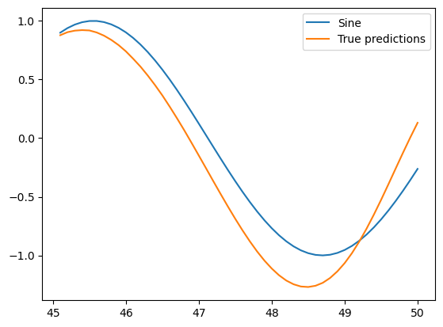

### 84. RNN on a Sine Wave - LSTMs and Forecasting
```py
from tensorflow.keras.callbacks import EarlyStopping
early_stop = EarlyStopping(monitor='val_loss', patience=2)
#validation_generator = TimeseriesGenerator(scaled_test,scaled_test,
#                                           length=length,batch_size=1)
# `start_index+length=50 > end_index=49` is disallowed
length = 49 # smaller than 50
generator = TimeseriesGenerator(scaled_train, scaled_train,
                                length=length,batch_size=1)
validation_generator = TimeseriesGenerator(scaled_test,scaled_test,
                                           length=length,batch_size=1)
model = Sequential()
model.add(LSTM(50,input_shape=(length,n_features)))
model.add(Dense(1))
model.compile(optimizer='adam', loss='mse')
model.summary()
'''
Model: "sequential_1"
┏━━━━━━━━━━━━━━━━━━━━━━━━━━━━━━━━━┳━━━━━━━━━━━━━━━━━━━━━━━━┳━━━━━━━━━━━━━━━┓
┃ Layer (type)                    ┃ Output Shape           ┃       Param # ┃
┡━━━━━━━━━━━━━━━━━━━━━━━━━━━━━━━━━╇━━━━━━━━━━━━━━━━━━━━━━━━╇━━━━━━━━━━━━━━━┩
│ lstm (LSTM)                     │ (None, 50)             │        10,400 │
├─────────────────────────────────┼────────────────────────┼───────────────┤
│ dense_1 (Dense)                 │ (None, 1)              │            51 │
└─────────────────────────────────┴────────────────────────┴───────────────┘
 Total params: 10,451 (40.82 KB)
 Trainable params: 10,451 (40.82 KB)
 Non-trainable params: 0 (0.00 B)
'''
model.fit(generator,epochs=20,
          validation_data=validation_generator,
          callbacks=[early_stop]) # fit_generator() deprecated. validation_generator into validation_data
test_predictions = []
first_eval_batch = scaled_train[-length:]
current_batch = first_eval_batch.reshape(1,length,n_features)
for i in range (len(test)):
  current_pred = model.predict(current_batch)[0]
  test_predictions.append(current_pred)
  current_batch = np.append(current_batch[:,1:,:], [[current_pred]], axis=1)
true_predictions = scaler.inverse_transform(test_predictions)  
test['Predictions'] = true_predictions
plt.plot(test)
plt.show()
```

### 85. RNN on a Time Series - Part One
```py
import pandas as pd
import numpy as np
#%matplotlib inline
import matplotlib.pyplot as plt
df = pd.read_csv('./tmp/DATA/RSCCASN.csv',index_col='DATE',parse_dates=True)
df.columns= ['Sales']
df.plot()
len(df) # 334
df.head() # monthly data
test_size = 18
test_ind = len(df) - test_size
train = df.iloc[:test_ind]
test = df.iloc[test_ind:]
from sklearn.preprocessing import MinMaxScaler
scaler = MinMaxScaler()
scaler.fit(train)
scaled_train = scaler.transform(train)
scaled_test = scaler.transform(test)
from tensorflow.keras.preprocessing.sequence import TimeseriesGenerator
len(test) # 18
# data length must be shorter than len(test) = 18
length = 12
generator = TimeseriesGenerator(scaled_train,scaled_train,
                                length=length,batch_size=1)
X,y=generator[0]
```

### 86. RNN on a Time Series - Part Two
```py
from tensorflow.keras.models import Sequential
from tensorflow.keras.layers import Dense, LSTM
n_features=1
model = Sequential()
model.add(LSTM(100,activation='relu', input_shape=(length,n_features)))
model.add(Dense(1))
model.compile(optimizer='adam',loss='mse')
model.summary()
'''
┏━━━━━━━━━━━━━━━━━━━━━━━━━━━━━━━━━┳━━━━━━━━━━━━━━━━━━━━━━━━┳━━━━━━━━━━━━━━━┓
┃ Layer (type)                    ┃ Output Shape           ┃       Param # ┃
┡━━━━━━━━━━━━━━━━━━━━━━━━━━━━━━━━━╇━━━━━━━━━━━━━━━━━━━━━━━━╇━━━━━━━━━━━━━━━┩
│ lstm_2 (LSTM)                   │ (None, 100)            │        40,800 │
├─────────────────────────────────┼────────────────────────┼───────────────┤
│ dense (Dense)                   │ (None, 1)              │           101 │
└─────────────────────────────────┴────────────────────────┴───────────────┘
 Total params: 40,901 (159.77 KB)
 Trainable params: 40,901 (159.77 KB)
 Non-trainable params: 0 (0.00 B)
'''
from tensorflow.keras.callbacks import EarlyStopping
early_stop = EarlyStopping(monitor='val_loss',patience=2)
validation_generator = TimeseriesGenerator(scaled_test,scaled_test,
                                           length=length,batch_size=1)
model.fit(generator,epochs=20,validation_data=validation_generator,
          callbacks=[early_stop])
# stopped at 5 epochs
losses = pd.DataFrame(model.history.history)
test_predictions = []
first_eval_batch = scaled_train[-length:]
current_batch = first_eval_batch.reshape(1,length,n_features)
for i in range (len(test)):
  current_pred = model.predict(current_batch)[0]
  test_predictions.append(current_pred)
  current_batch = np.append(current_batch[:,1:,:], [[current_pred]], axis=1)
true_predictions = scaler.inverse_transform(test_predictions)  
test['Predictions'] = true_predictions
test.plot()
```
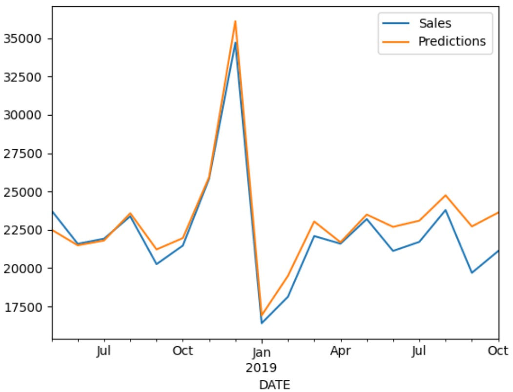
```py
forecast = []
periods = 12
first_eval_batch = scaled_full_data[-length:]
current_batch = first_eval_batch.reshape(1,length,n_features)
for i in range (periods):
  current_pred = model.predict(current_batch)[0]
  forecast.append(current_pred)
  current_batch = np.append(current_batch[:,1:,:], [[current_pred]], axis=1)
forecast = scaler.inverse_transform(forecast)  
forecast_index = pd.date_range(start='2019-11-01',periods=periods,
                               freq="MS") # month start frequency
# 2019-11-01, 2019-12-01, ... 2020-10-01
forecast_df  = pd.DataFrame(data=forecast,index=forecast_index,
                            columns=['Forecast'])
ax = df.plot()
forecast_df.plot(ax=ax) # combinning two plots
```
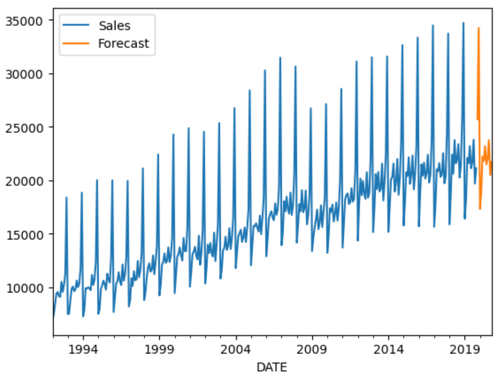

### 87. RNN Exercise

### 88. RNN Exercise - Solutions

### 89. Bonus - Multivariate Time Series - RNN and LSTMs
- SARIMAX/VARMAX models
- Setting up multivariate data requires 2 main changes
  - Change input shae to reflect 2D-structure
  - Final dense layer should have a neuron per feature/variable
```py
# define model
model = Sequential()
# Simple RNN layer
model.add(LSTM(100,input_shape=(length,scaled_train.shape[1]))) # n_features=28
# Final Prediction (one neuron per feature)
model.add(Dense(scaled_train.shape[1]))
model.compile(optimizer='adam', loss='mse')
```

## Section 10: Natual Language Processing

### 90. Introduction to NLP Section
- The unreasonable effectiveness of RNNs by Andrej Karpathy
- Step 1: Read in text data
- Step 2: Text processing and vectorization
- Step 3: Creating batches
- Step 4: Creating the model
  - Embedding
  - GRU: similar to LSTM but lacks some parameters/output
  - Dense
- Step 5: training the mdoel
- Step 6: Generating the new text

### 91. NLP - Part One - The Data
```py
import numpy as np
import pandas as pd
import matplotlib.pyplot as plt
import tensorflow as tf
path_to_file = "tmp/06-NLP-and-Text-Data/shakespeare.txt"
text = open(path_to_file,'r').read()
vocab = sorted(set(text))
len(vocab) # 84, characters, white space, new line, quotation marks, ...
```

### 92. NLP - Part Two - Text Processing
- Vectorize the text
- Create encoding dictionary
```py
#for pair in enumerate(vocab):
#  print(pair)
char_to_ind = {char:ind for ind,char in enumerate(vocab)}
char_to_ind['H'] # 33
ind_to_char = np.array(vocab)
ind_to_char[33] # np.str_('H')
encoded_text = np.array([char_to_ind[c] for c in text]) # entire text into array
encoded_text.shape # (5445609,)
```

### 93. NLP - Part Three - Creating Batches
- Understand text sequences
- Use Tensorflow datasets to generate batches
- Shuffle batches
```py
#for item in char_dataset.take(500):
#  print(ind_to_char[item.numpy()])
sequences = char_dataset.batch(seq_len+1,drop_remainder=True)
def create_seq_targets(seq):
  input_txt = seq[:-1] # Hello worl
  target_txt = seq[1:] # ello world
  return input_txt,target_txt
dataset = sequences.map(create_seq_targets)  
for input_txt, target_txt in dataset.take(1):
  print(input_txt.numpy())
  print("".join(ind_to_char[input_txt.numpy()]))
  print(target_txt.numpy())
  print("".join(ind_to_char[target_txt.numpy()]))
'''
[ 0  1  1  1  1  1  1  1  1  1  1  1  1  1  1  1  1  1  1  1  1  1 12  0
  1  1 31 73 70 68  1 61 56 64 73 60 74 75  1 58 73 60 56 75 76 73 60 74
  1 78 60  1 59 60 74 64 73 60  1 64 69 58 73 60 56 74 60  8  0  1  1 45
 63 56 75  1 75 63 60 73 60 57 80  1 57 60 56 76 75 80  5 74  1 73 70 74
 60  1 68 64 62 63 75  1 69 60 77 60 73  1 59 64 60  8  0  1  1 27 76 75]

                     1
  From fairest creatures we desire increase,
  That thereby beauty's rose might never die,
  But
[ 1  1  1  1  1  1  1  1  1  1  1  1  1  1  1  1  1  1  1  1  1 12  0  1
  1 31 73 70 68  1 61 56 64 73 60 74 75  1 58 73 60 56 75 76 73 60 74  1
 78 60  1 59 60 74 64 73 60  1 64 69 58 73 60 56 74 60  8  0  1  1 45 63
 56 75  1 75 63 60 73 60 57 80  1 57 60 56 76 75 80  5 74  1 73 70 74 60
  1 68 64 62 63 75  1 69 60 77 60 73  1 59 64 60  8  0  1  1 27 76 75  1]
                     1
  From fairest creatures we desire increase,
  That thereby beauty's rose might never die,
  But 
'''
batch_size=128
buffer_size=10000
dataset = dataset.shuffle(buffer_size).batch(batch_size,drop_remainder=True)
dataset # <_BatchDataset element_spec=(TensorSpec(shape=(128, 120), dtype=tf.int64, name=None), TensorSpec(shape=(128, 120), dtype=tf.int64, name=None))>
```

### 94. NLP - Part Four - Creating the Model
- Set up loss function
- Create model
  - Embedding
  - GRU
  - Dense
```py
vocab_size = len(vocab)
embed_dim = 64
rnn_neurons = 1026
from tensorflow.keras.losses import sparse_categorical_crossentropy
def sparse_cat_loss(y_true, y_pred):
  return sparse_categorical_crossentropy(y_true,y_pred,from_logits=True)
from tensorflow.keras.models import Sequential
from tensorflow.keras.layers import Embedding,GRU,Dense  
def create_model(vocab_size,embed_dim, rnn_neurons,batch_size):
  model = Sequential()
  model.add(tf.keras.Input(shape=(None,),batch_size=batch_size))
  model.add(Embedding(vocab_size,embed_dim))
  #model.add(Embedding(vocab_size, embed_dim,batch_input_shape=[batch_size, None])) # deprecated
  model.add(GRU(rnn_neurons,return_sequences=True,stateful=True,recurrent_initializer='glorot_uniform'))
  model.add(Dense(vocab_size))
  model.compile('adam', loss=sparse_cat_loss)
  return model
model = create_model(vocab_size=vocab_size, embed_dim=embed_dim,
                    rnn_neurons=rnn_neurons,batch_size=batch_size)  
model.summary()                    
'''
┏━━━━━━━━━━━━━━━━━━━━━━━━━━━━━━━━━┳━━━━━━━━━━━━━━━━━━━━━━━━┳━━━━━━━━━━━━━━━┓
┃ Layer (type)                    ┃ Output Shape           ┃       Param # ┃
┡━━━━━━━━━━━━━━━━━━━━━━━━━━━━━━━━━╇━━━━━━━━━━━━━━━━━━━━━━━━╇━━━━━━━━━━━━━━━┩
│ embedding_7 (Embedding)         │ (128, None, 64)        │         5,376 │
├─────────────────────────────────┼────────────────────────┼───────────────┤
│ gru_3 (GRU)                     │ (128, None, 1026)      │     3,361,176 │
├─────────────────────────────────┼────────────────────────┼───────────────┤
│ dense_1 (Dense)                 │ (128, None, 84)        │        86,268 │
└─────────────────────────────────┴────────────────────────┴───────────────┘
 Total params: 3,452,820 (13.17 MB)
 Trainable params: 3,452,820 (13.17 MB)
 Non-trainable params: 0 (0.00 B)
'''
```

### 95. NLP - Part Five - Training the Model
- How to train
- How to load our saved model file
```py
#for input_example_batch,target_example_batch in dataset.take(1):
#  example_batch_predictions = model(input_example_batch)
#example_batch_predictions.shape # TensorShape([128, 120, 84])
sampled_indices = tf.random.categorical(example_batch_predictions[0],num_samples=1)
sampled_indices = tf.squeeze(sampled_indices,axis=-1).numpy()
epochs = 30
model.fit(dataset,epochs=epochs) # may take > 30min on a GPU
```
- As the model training is very expensive, we will practice using the pre-made model data

### 96. NLP - Part Six - Generating Text
```py
from tensorflow.keras.models import load_model
model = create_model(vocab_size=vocab_size, embed_dim=embed_dim,
                    rnn_neurons=rnn_neurons,batch_size=1)  
model.load_weights('tmp/06-NLP-and-Text-Data/shakespeare_gen.h5')
model.build(tf.TensorShape([1,None]))
model.summary()
'''
┏━━━━━━━━━━━━━━━━━━━━━━━━━━━━━━━━━┳━━━━━━━━━━━━━━━━━━━━━━━━┳━━━━━━━━━━━━━━━┓
┃ Layer (type)                    ┃ Output Shape           ┃       Param # ┃
┡━━━━━━━━━━━━━━━━━━━━━━━━━━━━━━━━━╇━━━━━━━━━━━━━━━━━━━━━━━━╇━━━━━━━━━━━━━━━┩
│ embedding_8 (Embedding)         │ (1, None, 64)          │         5,376 │
├─────────────────────────────────┼────────────────────────┼───────────────┤
│ gru_4 (GRU)                     │ (1, None, 1026)        │     3,361,176 │
├─────────────────────────────────┼────────────────────────┼───────────────┤
│ dense_2 (Dense)                 │ (1, None, 84)          │        86,268 │
└─────────────────────────────────┴────────────────────────┴───────────────┘
 Total params: 3,452,820 (13.17 MB)
 Trainable params: 3,452,820 (13.17 MB)
 Non-trainable params: 0 (0.00 B)
'''
def generate_text(model,start_seed,gen_size=500,temp=1.0):
  num_generate = gen_size
  input_eval = [char_to_ind[s] for s in start_seed]
  input_eval = tf.expand_dims(input_eval,0)
  text_generated = []
  temperature = temp
  model.reset_metrics() # reset_states() deprecated?
  for i in range(num_generate):
    predictions = model(input_eval)
    predictions = tf.squeeze(predictions,0)
    predictions = predictions/temperature
    predicted_id = tf.random.categorical(predictions,num_samples=1)[-1,0].numpy()
    input_eval = tf.expand_dims([predicted_id],0)
    text_generated.append(ind_to_char[predicted_id])
  return (start_seed+"".join(text_generated))
print(generate_text(model,"JULIET", gen_size=1000))
'''
JULIETES]  PROJIBTAGUS and VIRGILIA
    You megmaking the condriest throne of Caius,
    Why, he is slowoped of his brother,
    To win ere is my name. Two maid opon.
    Where's Romeo's man?
  PAULINA. The end now is a fool's livery
    Stoop'd herefore I will twenty years ago Henry,  
    Hath given thee far and die    Forbid my nce with Britches his good; and for
    your few laughing  shall, Duke of York,
    Smartensirely beseech you him;
    If nonepo some better parpowes than pleasure.
  PAULINA. The help of Athens would not then hear.
  KING. My lord, my lord;
    is it count'd him as hed arms
    seems we now as some actiest work of his manners.
  Claud. Well, young gods,
    They say within the file that all before him.
  WIDOW. See, Cassius, I beseech you ever
    That most unspeak for awhile, that hungrapaction,
    Do y and what they will with lob enough; your Greeks have stol'n
    To kill by boot unto this dow;                             [KING RICHARD] Billad, am, ill lodg'd 
'''    
```

## Section 11: AutoEncoders

### 97. Introduction to Autoencoders
- Unsupervised learning
  - Semi-supervised
- Applications
  - Dimensionality reduction
  - Noise removal
  - Semi-supervised because we may correct labels during the training of the autoencoder

### 98. Autoencoder Basics
- Similar to a multi-layer perceptron model
- The number of input neurons is equal to the number of output neurons
- Similar to PCA (Principle Component Analysis)
- The hidden layer is NOT simply sub-selecting only certain features
  - It calculates the combinations of the original features represent the original data in a reduced dimensional space
  - The center hidden layer reduces the dimensionality to learn the most important combinations of original features
- Use cases
  - Dimensional reduction
  - Noise removal

### 99. Autoencoder for Dimensionality Reduction
- Encoder: High dimensionality into small dimensionality
- Decoder: Small dimensionality into high dimensionality
- Dimensionality reduction
  - Compress data
  - Visualize data in lower dimensions
  - Reveal hidden relationships not clearly seen in higher dimensions
```py
import numpy as np
import pandas as pd
import seaborn as sns
import matplotlib.pyplot as plt
from sklearn.datasets import make_blobs
data = make_blobs(n_samples=300, n_features=2,
                  centers=2, cluster_std=1.0, 
                  random_state=101)
X,y=data
np.random.seed(seed=101)
z_noise = np.random.normal(size=len(X))
z_noise = pd.Series(z_noise)
feat = pd.DataFrame(X)
feat = pd.concat([feat, z_noise],axis=1)
feat.columns = ['X1', 'X2', 'X3']
feat.head()
plt.scatter(feat['X1'], feat['X2'], c=y)
```
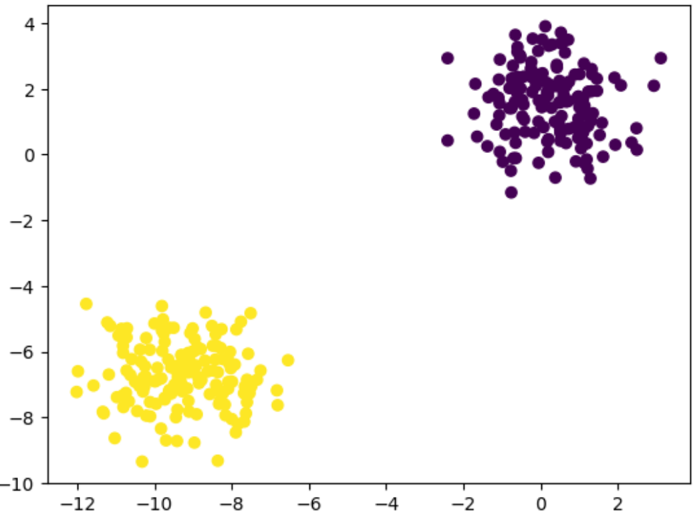
```py
from mpl_toolkits.mplot3d import Axes3D
fig = plt.figure()
ax = fig.add_subplot(111,projection='3d')
ax.scatter(feat['X1'],feat['X2'],feat['X3'],c=y)
```
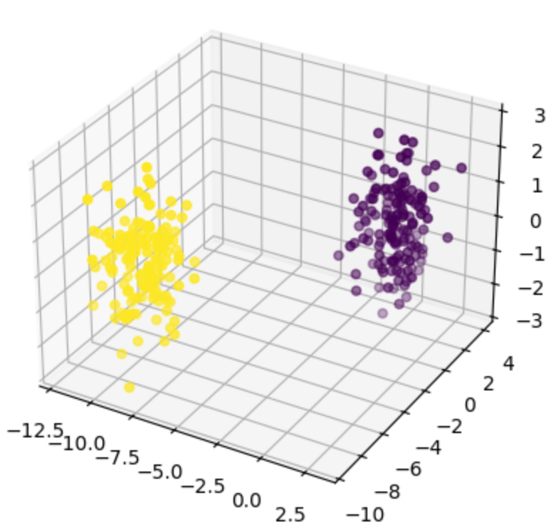
```py
from tensorflow.keras.models import Sequential
from tensorflow.keras.layers import Dense
from tensorflow.keras.optimizers import SGD
# 3-->2-->3
encoder = Sequential()
encoder.add(Dense(units=2, activation='relu', input_shape=[3]))
decoder = Sequential()
decoder.add(Dense(units=3, activation='relu', input_shape=[2]))
autoencoder = Sequential([encoder,decoder])
autoencoder.compile(loss='mse', optimizer=SGD(learning_rate=1.5))
from sklearn.preprocessing import MinMaxScaler
scaler = MinMaxScaler()
scaled_data = scaler.fit_transform(feat)
autoencoder.fit(scaled_data,scaled_data,epochs=5)
encoded_2dim = encoder.predict(scaled_data)
print(encoded_2dim)
encoded_2dim.shape # (300, 2)
scaled_data.shape # (300, 3)
plt.scatter(encoded_2dim[:,0], encoded_2dim[:,1], c=y)
```

### 100. Autoencoder for Images - Part One
- A 28x28 image has 784 features/dimensions
- Let's explore 2 autoencoders
  - Attempt to recreate input images in the output
  - Remove noise from input images to reproduce output accurately
```py
from tensorflow.keras.datasets import mnist
(X_train, y_train), (X_test, y_test) = mnist.load_data()
#plt.imshow(X_train[0])
X_train= X_train/255
X_test = X_test/255
from tensorflow.keras.models import Sequential
from tensorflow.keras.layers import Dense, Flatten, Reshape
from tensorflow.keras.optimizers import SGD
#28*28/2 = 392 -> Let's use 400
encoder = Sequential()
encoder.add(Flatten(input_shape=[28,28]))
encoder.add(Dense(400,activation='relu'))
encoder.add(Dense(200,activation='relu'))
encoder.add(Dense(100,activation='relu'))
encoder.add(Dense(50,activation='relu'))
encoder.add(Dense(25,activation='relu'))
# 25/784 = 0.0318 -> 3% out of the original image
decoder = Sequential()
decoder.add(Dense(50, input_shape=[25], activation='relu'))
decoder.add(Dense(100,activation='relu'))
decoder.add(Dense(200,activation='relu'))
decoder.add(Dense(400,activation='relu'))
decoder.add(Dense(784,activation='sigmoid'))
decoder.add(Reshape([28,28]))
autoencoder = Sequential([encoder,decoder])
autoencoder.compile(loss='binary_crossentropy', # matching the original image or not
                    optimizer=SGD(learning_rate=1.5),
                    metrics=['accuracy'])
autoencoder.fit(X_train, X_train, epochs=5, 
                validation_data=[X_test, X_test])
passed_images = autoencoder.predict(X_test[:10])
n = 0
print("Original Image / Attempted reconstruction(after autoencoder)")
fig,axes = plt.subplots(nrows=1,ncols=2)
axes[0].imshow(X_test[n])
axes[1].imshow(passed_images[n])
```
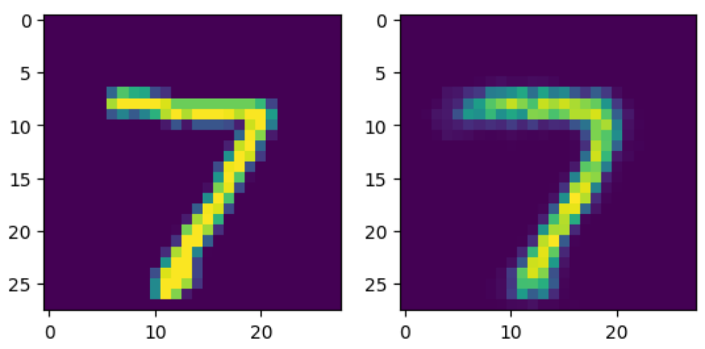

### 101. Autoencoder for Images - Part Two - Noise Removal
- Add noise then remove noise using autoencoder
```py
from tensorflow.keras.layers import GaussianNoise
sample = GaussianNoise(0.2)
noisey = sample(X_test[:10], training=True)
n = 0
print("ORIGINAL/NOISEY version")
fig,axes = plt.subplots(nrows=1,ncols=2)
axes[0].imshow(X_test[n])
axes[1].imshow(noisey[n])
```
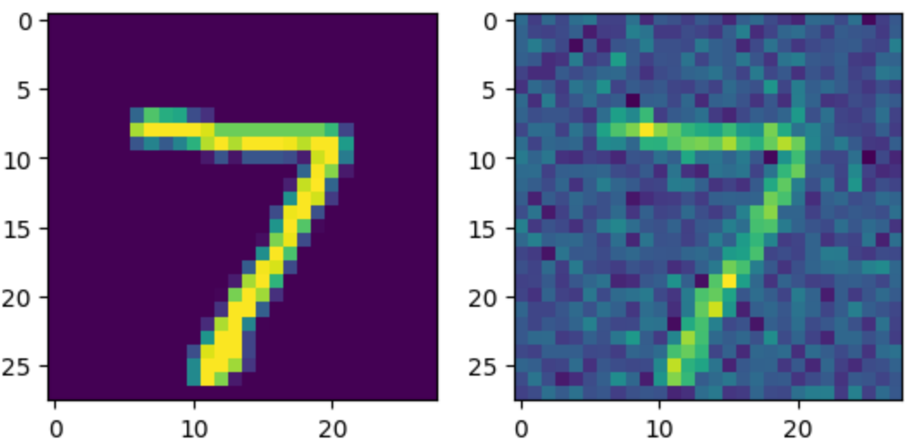
```py
import tensorflow as tf
tf.random.set_seed(101)
encoder = Sequential()
encoder.add(Flatten(input_shape=[28,28]))
encoder.add(GaussianNoise(0.2))
encoder.add(Dense(400,activation='relu'))
encoder.add(Dense(200,activation='relu'))
encoder.add(Dense(100,activation='relu'))
encoder.add(Dense(50,activation='relu'))
encoder.add(Dense(25,activation='relu'))
# 25/784 = 0.0318 -> 3% out of the original image
decoder = Sequential()
decoder.add(Dense(50, input_shape=[25], activation='relu'))
decoder.add(Dense(100,activation='relu'))
decoder.add(Dense(200,activation='relu'))
decoder.add(Dense(400,activation='relu'))
decoder.add(Dense(784,activation='sigmoid'))
decoder.add(Reshape([28,28]))
noise_remover = Sequential([encoder,decoder])
noise_remover.compile(loss='binary_crossentropy',
                    optimizer='adam',
                    metrics=['accuracy'])
noise_remover.fit(X_train, X_train, epochs=8)
#
ten_noisey_images = sample(X_test[:10], training=True)
denoised = noise_remover(ten_noisey_images)
print("ORIGINAL/NOISE ADDED /NOISE removed")
fig,axes = plt.subplots(nrows=1,ncols=3)
n=0
axes[0].imshow(X_test[n])
axes[1].imshow(ten_noisey_images[n])
axes[2].imshow(denoised[n])
```
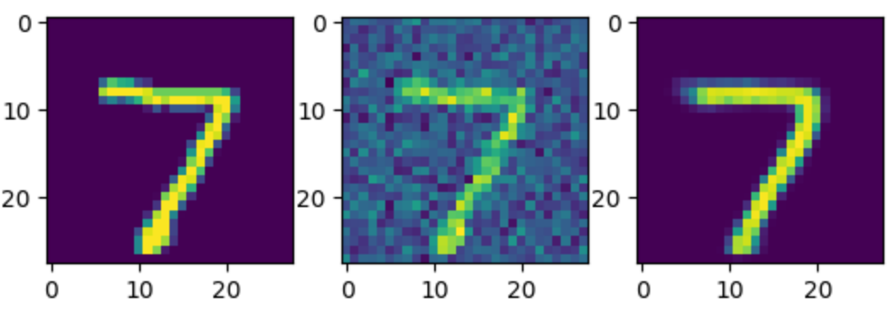

### 102. Autoencoder Exercise Overview
- How to find which candidate has the most drastically different data?
- Dimensional reduction

### 103. Autoencoder Exercise - Solutions
```py
import pandas as pd
import numpy as np
import matplotlib.pyplot as plt
df = pd.read_csv('./tmp/DATA/UK_foods.csv', index_col='Unnamed: 0')
df = df.transpose()
df.head()
'''
        Cheese	Carcass_meat	Other_meat	Fish	Fats_and_oils	Sugars	Fresh_potatoes	Fresh_Veg	Other_Veg	Processed_potatoes	Processed_Veg	Fresh_fruit	Cereals	Beverages	Soft_drinks	Alcoholic_drinks	Confectionery
England	105	245	685	147	193	156	720	253	488	198	360	1102	1472	57	1374	375	54
Wales	103	227	803	160	235	175	874	265	570	203	365	1137	1582	73	1256	475	64
Scotland	103	242	750	122	184	147	566	171	418	220	337	957	1462	53	1572	458	62
N.Ireland	66	267	586	93	209	139	1033	143	355	187	334	674	1494	47	1506	135	41

'''
from tensorflow.keras.models import Sequential
from tensorflow.keras.layers import Dense
from tensorflow.keras.optimizers import SGD
encoder = Sequential()
encoder.add(Flatten(input_shape=[17]))
encoder.add(Dense(8,activation='relu'))
encoder.add(Dense(4,activation='relu'))
encoder.add(Dense(2,activation='relu'))
decoder = Sequential()
encoder.add(Flatten(input_shape=[2]))
decoder.add(Dense(units=4,activation='relu'))
decoder.add(Dense(units=8,activation='relu'))
decoder.add(Dense(units=17,activation='relu'))
autoencoder = Sequential([encoder,decoder])
autoencoder.compile(loss='mse', optimizer=SGD(learning_rate=1.5))
from sklearn.preprocessing import MinMaxScaler
scaler = MinMaxScaler()
scaled_df = scaler.fit_transform(df.values)
scaled_df.shape # (4, 17)
# 
autoencoder.fit(scaled_df,scaled_df, epochs=15)
# after training, we use encoder only for dimensional reduction
encoded_2dim = encoder.predict(scaled_df)
df.index
results = pd.DataFrame(data=encoded_2dim,index=df.index, columns=['C1','C2'])
results
'''
            	C1	C2
England	0.309264	1.606499
Wales	0.482425	2.400198
Scotland	0.281934	1.204633
N.Ireland	0.000000	1.080878
'''
```
- This shows that N.Ireland is drastically different

## Section 12: Generative Adversarial Networks

### 104. GANs Overview
- Invented by Ian Goodfellow 2014
- Two networks compete each other
- Generator
  - Receives random noise (Gaussian distribution)
  - Outputs data (often an image)
- Discriminator
  - Takes a data set consisting of real images from the real data and fake images from the generator
  - Attempts to classify real vs fake images (always binary classificaton)
- Generator tries to fool discriminator using fake images
- Discriminator tries to figure real or fake (1 or 0)
- After many trials, generator can create images that actually fool the discriminator
- Training phases
  - Phase 1 - train discriminator
    - Real images (=1) are combined with fake images from generator (=0)
    - Discriminator trains to distinguish real from fake
  - Phase 2 - train generator
    - Produces fake images with generator
    - Feeds only these fake images to the generator with all labels set as real (=1)
    - This causes the generator to attempt to produce images that the discriminator believes to be real
    - Because we feed in fake images all with labeled 1, we only perform backpropagation on the generator weights in this step
- Generator NEVER gets to see the actual real images
  - It generates convincing images only based off gradients flowing back through the discriminator
- Difficulties with GANs
  - Training resources
  - Mode collapse
    - A few images from generator fool the discriminator
    - DCGANs (Deep Convolutional GANs) might be used to avoid mod collapse
  - Instability
    - It is difficult to ascertain performance and appropriate training epochs as generated images are all "fake"
    - Oscillation b/w performance of generator and discriminator
    - Hyperparameters experiment is necessary

### 105. Creating a GAN - Part One- The Data
```py
import numpy as np
import pandas as pd
import matplotlib.pyplot as plt
from tensorflow.keras.datasets import mnist
(X_train,y_train),(X_test, y_test) = mnist.load_data()
#plt.imshow(X_train[0])
only_zeros = X_train[y_train==0]
only_zeros.shape # (5923, 28, 28)
X_train.shape # (60000, 28, 28)
#plt.imshow(only_zeros[10])
```

### 106. Creating a GAN - Part Two - The Model
```py
import tensorflow as tf
from tensorflow.keras.layers import Dense,Reshape,Flatten
from tensorflow.keras.models import Sequential
discriminator = Sequential()
discriminator.add(Flatten(input_shape=[28,28]))
discriminator.add(Dense(150,activation='relu'))
discriminator.add(Dense(100,activation='relu'))
# final output layer
discriminator.add(Dense(1, activation='sigmoid'))
discriminator.compile(loss='binary_crossentropy', optimizer='adam')
codings_size = 100
# 784 -> 150 -> 100 -> 150 -> 784
generator = Sequential()
generator.add(Flatten(input_shape=[codings_size]))
generator.add(Dense(100,activation='relu'))
generator.add(Dense(150,activation='relu'))
generator.add(Dense(784,activation='relu'))
generator.add(Reshape([28,28]))
GAN = Sequential([generator,discriminator])
discriminator.trainable = False
GAN.compile(loss='binary_crossentropy', optimizer='adam')
```

### 107. Creating a GAN - Part Three - Model Training
```py
batch_size = 32
# my_data = X_train
my_data = only_zeros
dataset = tf.data.Dataset.from_tensor_slices(my_data).shuffle(buffer_size=1000)
type(dataset)
dataset = dataset.batch(batch_size,drop_remainder=True) # 5923/32 = 185.09 => 185 sets
epochs = 1
print(GAN.layers[0].layers) # generator, [<Flatten name=flatten_3, built=True>, <Dense name=dense_9, built=True>, <Dense name=dense_10, built=True>, <Dense name=dense_11, built=True>, <Reshape name=reshape_1, built=True>]
print(GAN.layers[1].layers) # discriminiator, [<Flatten name=flatten_2, built=True>, <Dense name=dense_6, built=True>, <Dense name=dense_7, built=True>, <Dense name=dense_8, built=True>]
print(GAN.layers[0].summary())
'''
┏━━━━━━━━━━━━━━━━━━━━━━━━━━━━━━━━━┳━━━━━━━━━━━━━━━━━━━━━━━━┳━━━━━━━━━━━━━━━┓
┃ Layer (type)                    ┃ Output Shape           ┃       Param # ┃
┡━━━━━━━━━━━━━━━━━━━━━━━━━━━━━━━━━╇━━━━━━━━━━━━━━━━━━━━━━━━╇━━━━━━━━━━━━━━━┩
│ flatten_3 (Flatten)             │ (None, 100)            │             0 │
├─────────────────────────────────┼────────────────────────┼───────────────┤
│ dense_9 (Dense)                 │ (None, 100)            │        10,100 │
├─────────────────────────────────┼────────────────────────┼───────────────┤
│ dense_10 (Dense)                │ (None, 150)            │        15,150 │
├─────────────────────────────────┼────────────────────────┼───────────────┤
│ dense_11 (Dense)                │ (None, 784)            │       118,384 │
├─────────────────────────────────┼────────────────────────┼───────────────┤
│ reshape_1 (Reshape)             │ (None, 28, 28)         │             0 │
└─────────────────────────────────┴────────────────────────┴───────────────┘
 Total params: 143,634 (561.07 KB)
 Trainable params: 143,634 (561.07 KB)
 Non-trainable params: 0 (0.00 B)
'''
print(GAN.layers[1].summary())
'''
━━━━━━━━━━━━━━━━━━━━━━━━━━━━━━━━━┳━━━━━━━━━━━━━━━━━━━━━━━━┳━━━━━━━━━━━━━━━┓
┃ Layer (type)                    ┃ Output Shape           ┃       Param # ┃
┡━━━━━━━━━━━━━━━━━━━━━━━━━━━━━━━━━╇━━━━━━━━━━━━━━━━━━━━━━━━╇━━━━━━━━━━━━━━━┩
│ flatten_2 (Flatten)             │ (None, 784)            │             0 │
├─────────────────────────────────┼────────────────────────┼───────────────┤
│ dense_6 (Dense)                 │ (None, 150)            │       117,750 │
├─────────────────────────────────┼────────────────────────┼───────────────┤
│ dense_7 (Dense)                 │ (None, 100)            │        15,100 │
├─────────────────────────────────┼────────────────────────┼───────────────┤
│ dense_8 (Dense)                 │ (None, 1)              │           101 │
└─────────────────────────────────┴────────────────────────┴───────────────┘
 Total params: 132,951 (519.34 KB)
 Trainable params: 0 (0.00 B)
 Non-trainable params: 132,951 (519.34 KB)
'''
print([[0.0]]*5, [[0.0]*5])# [[0.0], [0.0], [0.0], [0.0], [0.0]] [[0.0, 0.0, 0.0, 0.0, 0.0]]
generator,discriminator = GAN.layers
# train loop
for epoch in range(epochs):
  print(f"Currently on Epochs {epoch+1}")
  i = 0
  for X_batch in dataset:
    i = i + 1
    if i%100 == 0:
      print(f"\t Currently on batch number {i} of {len(my_data)//batch_size}")
    # discriminator
    noise = tf.random.normal(shape = [batch_size,codings_size])
    gen_images = generator(noise)
    X_fake_vs_real = tf.concat([gen_images,tf.dtypes.cast(X_batch,tf.float32)], axis=0)
    y1 = tf.constant([[0.0]]*batch_size + [[1.0]]*batch_size) # 0.0 (False) as many as of gen_images, 1.0 (True) as many as X_batch
    discriminator.trainable = True
    discriminator.train_on_batch(X_fake_vs_real,y1)
    # train generator
    noise = tf.random.normal(shape=[batch_size,codings_size])
    y2 = tf.constant([[1.0]]*batch_size)
    discriminator.trainable = False
    GAN.train_on_batch(noise,y2)
'''
Currently on Epochs 1
	 Currently on batch number 100 of 185
2026-01-30 09:46:38.244292: I tensorflow/core/framework/local_rendezvous.cc:407] Local rendezvous is aborting with status: OUT_OF_RANGE: End of sequence
'''    
noise = tf.random.normal(shape=[10,codings_size])
noise.shape # TensorShape([10, 100])
#plt.imshow(noise)
images = generator(noise)
plt.imshow(images[0])
```
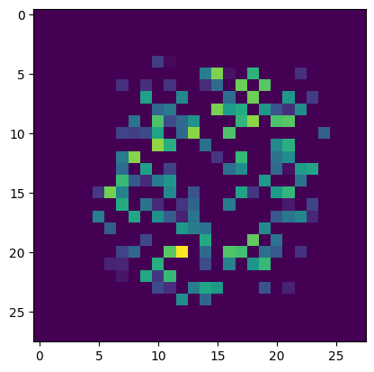
- Compare images[0] with other image [1,2,3,..]
  - All are similar => **Mode collapse**
  - How to resolve this issue? DCGAN
  
### 108. DCGAN - Deep Convolutional Generative Adversarial Networks
- GAN with convolutional layers
```py
(X_train,y_train),(X_test, y_test) = mnist.load_data()
X_train = X_train/255
X_train = X_train.reshape(-1,28,28,1)*2-1.
X_train.min() # np.float64(-1.0)
X_train.max() # np.float64(1.0)
only_zeros = X_train[y_train==0]
only_zeros.shape # (5923, 28, 28, 1)
import tensorflow as tf
from tensorflow.keras.layers import Dense,Reshape,Dropout,LeakyReLU,Flatten,BatchNormalization,Conv2D,Conv2DTranspose
from tensorflow.keras.models import Sequential
np.random.seed(42)
tf.random.set_seed(42)
codings_size = 100
generator = Sequential()
generator.add(Flatten(input_shape=[codings_size]))
generator.add(Dense(7*7*128))
generator.add(Reshape([7,7,128]))
generator.add(BatchNormalization())
generator.add(Conv2DTranspose(64,kernel_size=5,strides=2,
                              padding="same",activation="relu"))
generator.add(BatchNormalization())
generator.add(Conv2DTranspose(1,kernel_size=5,strides=2,
                             padding="same",activation="tanh"))
discriminator = Sequential()
discriminator.add(Conv2D(64,kernel_size=5,strides=2,
                         padding="same",activation=LeakyReLU(0.3),
                         input_shape=[28,28,1]))
discriminator.add(Dropout(0.5))
discriminator.add(Conv2D(128,kernel_size=5,strides=2,
                         padding="same",activation=LeakyReLU(0.3)))
discriminator.add(Dropout(0.5))
discriminator.add(Flatten())
discriminator.add(Dense(1,activation="sigmoid"))
GAN = Sequential([generator,discriminator])
discriminator.compile(loss="binary_crossentropy", optimizer="adam")
discriminator.trainable = False
GAN.compile(loss="binary_crossentropy", optimizer="adam")
GAN.summary()
'''
┏━━━━━━━━━━━━━━━━━━━━━━━━━━━━━━━━━┳━━━━━━━━━━━━━━━━━━━━━━━━┳━━━━━━━━━━━━━━━┓
┃ Layer (type)                    ┃ Output Shape           ┃       Param # ┃
┡━━━━━━━━━━━━━━━━━━━━━━━━━━━━━━━━━╇━━━━━━━━━━━━━━━━━━━━━━━━╇━━━━━━━━━━━━━━━┩
│ sequential_3 (Sequential)       │ (None, 28, 28, 1)      │       840,705 │
├─────────────────────────────────┼────────────────────────┼───────────────┤
│ sequential_4 (Sequential)       │ (None, 1)              │       212,865 │
└─────────────────────────────────┴────────────────────────┴───────────────┘
 Total params: 1,053,570 (4.02 MB)
 Trainable params: 840,321 (3.21 MB)
 Non-trainable params: 213,249 (833.00 KB)
'''
batch_size = 32
my_data = only_zeros
dataset = tf.data.Dataset.from_tensor_slices(my_data).shuffle(buffer_size=1000)
type(dataset) # tensorflow.python.data.ops.shuffle_op._ShuffleDataset
dataset = dataset.batch(batch_size,drop_remainder=True).prefetch(1)
epochs = 20
# Training
# Grab the seprate components
generator, discriminator = GAN.layers
# For every epcoh
for epoch in range(epochs):
    print(f"Currently on Epoch {epoch+1}")
    i = 0
    # For every batch in the dataset
    for X_batch in dataset:
        i=i+1
        if i%20 == 0:
            print(f"\tCurrently on batch number {i} of {len(my_data)//batch_size}")
        #####################################
        ## TRAINING THE DISCRIMINATOR ######
        ###################################
        # Create Noise
        noise = tf.random.normal(shape=[batch_size, codings_size])
        # Generate numbers based just on noise input
        gen_images = generator(noise)
        # Concatenate Generated Images against the Real Ones
        # TO use tf.concat, the data types must match!
        X_fake_vs_real = tf.concat([gen_images, tf.dtypes.cast(X_batch,tf.float32)], axis=0)
        # Targets set to zero for fake images and 1 for real images
        y1 = tf.constant([[0.]] * batch_size + [[1.]] * batch_size)
        # This gets rid of a Keras warning
        discriminator.trainable = True
        # Train the discriminator on this batch
        discriminator.train_on_batch(X_fake_vs_real, y1)
        #####################################
        ## TRAINING THE GENERATOR     ######
        ###################################
        # Create some noise
        noise = tf.random.normal(shape=[batch_size, codings_size])
        # We want discriminator to belive that fake images are real
        y2 = tf.constant([[1.]] * batch_size)
        # Avois a warning
        discriminator.trainable = False
        GAN.train_on_batch(noise, y2)
print("TRAINING COMPLETE")           
noise = tf.random.normal(shape=[10,codings_size])
noise.shape # TensorShape([10, 100])
#plt.imshow(noise)
images = generator(noise)
fig,axes = plt.subplots(nrows=1,ncols=2)
axes[0].imshow(images[0])
axes[1].imshow(images[1])
```
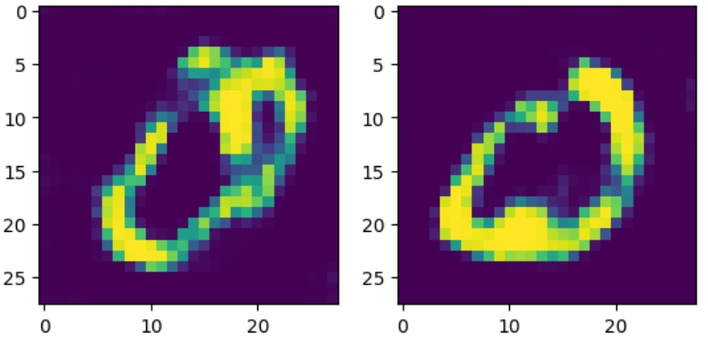
- Mode collapse is prevented

## Section 13: Deployment

### 109. Introduction to Deployment
- Steps
  - Create a model
  - Exporting a model
  - Creating a callable API
  - Calling the API with Postman
  - Calling the API with Python
  - Calling a model through Flask
  - Launching a full ML App to the web
- We assume that you're familiar with Web API

### 110. Creating the Model
```py
import numpy as np
import pandas as pd
iris = pd.read_csv("./tmp/DATA/iris.csv")
X = iris.drop('species',axis=1)
y = iris['species']
from sklearn.preprocessing import LabelBinarizer
encoder = LabelBinarizer()
y = encoder.fit_transform(y)
from sklearn.model_selection import train_test_split
from sklearn.preprocessing import MinMaxScaler
X_train, X_test, y_train, y_test = train_test_split(X, y, test_size=0.2, random_state=101)
scaler = MinMaxScaler()
scaler.fit(X_train)
scaled_X_train = scaler.transform(X_train)
scaled_X_test = scaler.transform(X_test)
from tensorflow.keras.models import Sequential
from tensorflow.keras.layers import Dense
model = Sequential()
model.add(Dense(units=4,activation='relu',input_shape=[4,]))
# Last layer for multi-class classification of 3 species
model.add(Dense(units=3,activation='softmax'))
model.compile(optimizer='adam',
              loss='categorical_crossentropy',metrics=['accuracy'])
from tensorflow.keras.callbacks import EarlyStopping
early_stop = EarlyStopping(patience=10)
model.fit(x=scaled_X_train, 
          y=y_train, 
          epochs=300,
          validation_data=(scaled_X_test, y_test), verbose=1 ,callbacks=[early_stop]         )
metrics = pd.DataFrame(model.history.history)
metrics[['loss','val_loss']].plot()
model.evaluate(scaled_X_test,y_test,verbose=0) # [0.48823851346969604, 0.8666666746139526]
# We reached 86% prediction
# retraining for deployment
epochs = len(metrics)
scaled_X = scaler.fit_transform(X)
model = Sequential()
model.add(Dense(units=4,activation='relu'))
# Last layer for multi-class classification of 3 species
model.add(Dense(units=3,activation='softmax'))
model.compile(optimizer='adam',
              loss='categorical_crossentropy',metrics=['accuracy'])
model.fit(scaled_X,y,epochs=epochs)
model.save("final_iris_model.h5")
import joblib
joblib.dump(scaler,'iris_scaler.pkl')
```

### 111. Model Prediction Function
- Following codes are exported:
```py
# how to load models
from tensorflow.keras.models import load_model
import numpy as np
import joblib
flower_model = load_model('final_iris_model.h5')
flower_scaler = joblib.load("iris_scaler.pkl")
#flower_example = {"sepal_length":5.1,"sepal_width":3.5,"petal_length":1.4,"petal_width":0.2}
def return_prediction(model,scaler,sample_json):
  s_len = sample_json["sepal_length"]
  s_wid = sample_json["sepal_width"]
  p_len = sample_json["petal_length"]
  p_wid = sample_json["petal_width"]
  flower = [[s_len,s_wid,p_len,p_wid]]
  classes = np.array(['setosa','versicolor','virginica'])
  flower = scaler.transform(flower)
  class_id = np.argmax((model.predict(flower)[0]),axis=0)
  return classes[class_id]
#return_prediction(flower_model,flower_scaler, flower_example)  # 0 -> setosa
```

### 112. Running a Basic Flask Application
- ch112.py:
```py
from flask import Flask
app = Flask(__name__)
@app.route("/")
def index():
    return '<h1> FLASK app is running </h1>'
if __name__ == "__main__":
    app.run()
```

### 113. Flask Postman API
- Couple the prediction function abve with Flask
```py
from flask import Flask,request,jsonify
import numpy as np
from tensorflow.keras.models import load_model
import joblib
flower_model = load_model('final_iris_model.h5')
flower_scaler = joblib.load("iris_scaler.pkl")
def return_prediction(model,scaler,sample_json):
    s_len = sample_json["sepal_length"]
    s_wid = sample_json["sepal_width"]
    p_len = sample_json["petal_length"]
    p_wid = sample_json["petal_width"]
    flower = [[s_len,s_wid,p_len,p_wid]]
    classes = np.array(['setosa','versicolor','virginica'])
    flower = scaler.transform(flower)
    class_id = np.argmax((model.predict(flower)[0]),axis=0)
    return classes[class_id]
app = Flask(__name__)
@app.route("/")
def index():
    return '<h1> FLASK app is running </h1>'
@app.route('/api/flower',methods=['POST'])
def flower_prediction():
    content = request.json
    result = return_prediction(flower_model,flower_scaler,content)
    return jsonify(result)
if __name__ == "__main__":
    app.run()
```
- Run as `python3 ch113.py`

### 114. Flask API - Using Requests Programmatically
- From jupyter or python interface
```py
import requests
flower_example = {
  "sepal_length":5.1,
  "sepal_width":3.5,
  "petal_length":1.4,
  "petal_width":0.2
}
result = requests.post("http://127.0.0.1:5000/api/flower", json=flower_example)
result.status_code # 200 means successful
print(result.text) # "setosa"
```

### 115. Flask Front End
- Prerequisites: HTML and Jinja templates
- App
  - Connect to .html files
    - Use Flask to create an HTML form and inject to home.html
    - Use Flask to accept submitted HTML form data
    - Use Flask to return prediction to prediction.html
- Home.html
  - Simple html file that uses a Flask based form to accept user input
- Prediction.html
  - Returns back predictions
- pip install flask_wtf  
- server.py:
```py
from flask import Flask,render_template,session,url_for,redirect
from flask_wtf import FlaskForm
import numpy as np
from wtforms import StringField,SubmitField
from tensorflow.keras.models import load_model
import joblib
flower_model = load_model('final_iris_model.h5')
flower_scaler = joblib.load("iris_scaler.pkl")
def return_prediction(model,scaler,sample_json):
    s_len = sample_json["sepal_length"]
    s_wid = sample_json["sepal_width"]
    p_len = sample_json["petal_length"]
    p_wid = sample_json["petal_width"]
    flower = [[s_len,s_wid,p_len,p_wid]]
    classes = np.array(['setosa','versicolor','virginica'])
    flower = scaler.transform(flower)
    class_id = np.argmax((model.predict(flower)[0]),axis=0)
    return classes[class_id]
app = Flask(__name__)
app.config['SECRET_KEY'] = 'myscecretkey'
class FlowerForm(FlaskForm):
    sep_len = StringField("Sepal Length")
    sep_wid = StringField("Sepal Width")
    pet_len = StringField("Petal Length")
    pet_wid = StringField("Petal Width")
    submit = SubmitField("Analyze")    
@app.route("/",methods=['GET', 'POST'])
def index():
    form = FlowerForm()
    if form.validate_on_submit():
        session['sep_len'] = form.sep_len.data
        session['sep_wid'] = form.sep_wid.data
        session['pet_len'] = form.pet_len.data
        session['pet_wid'] = form.pet_wid.data
        return redirect(url_for("prediction")) # to def prediction()
    return render_template('home.html',form=form)
@app.route('/prediction')
def prediction():
    content = {}
    content['sepal_length'] = float(session['sep_len'])
    content['sepal_width'] = float(session['sep_wid'])
    content['petal_length'] = float(session['pet_len'])
    content['petal_width'] = float(session['pet_wid'])
    result = return_prediction(flower_model,flower_scaler,content)
    return render_template('prediction.html',results=result)
if __name__ == "__main__":
    app.run()
```  
- template/home.html:
```html
<h1>FLASK APP RUNNING</h1>
<h2>Please enter your flower measurements below:</h2>
<form  method="POST">
    {# This hidden_tag is a CSRF security feature. #}
    {{ form.hidden_tag() }}
    {{ form.sep_len.label }} {{form.sep_len}}
    <br>
    {{ form.sep_wid.label}} {{form.sep_wid}}
    <br>
    {{form.pet_len.label}}{{form.pet_len}}
    <br>
    {{form.pet_wid.label}}{{form.pet_wid}}
    <br>
    {{ form.submit() }}
</form>
```
- template/prediction.html:
```html
<h1>Thank You. Here is the Information You Gave:</h1>
<ul>
	<li>Sepal Length: {{session['sep_len']}}</li>
	<li>Sepal Width:  {{session['sep_wid']}}</li>
	<li>Petal Length: {{session['pet_len']}}</li>
	<li>Petal Width:  {{session['pet_wid']}}</li>
</ul>
<h2>Your Predicted Flower Class is: {{results}}</h2>
```
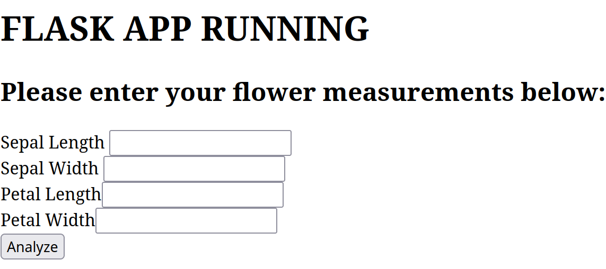
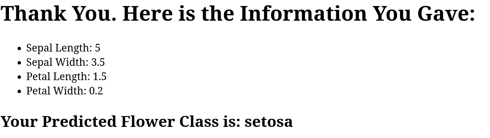

### 116. Live Deployment to the Web
- Heroku account: https://www.heroku.com/
