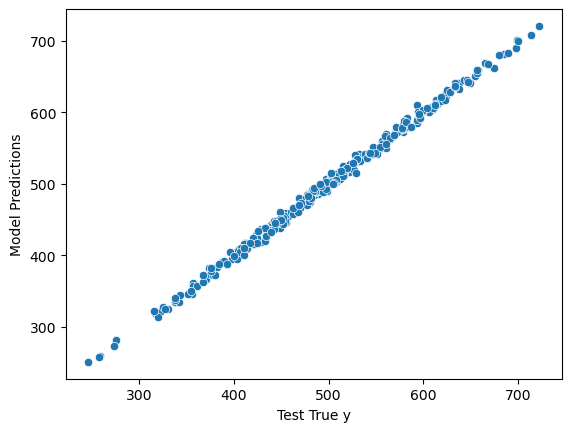
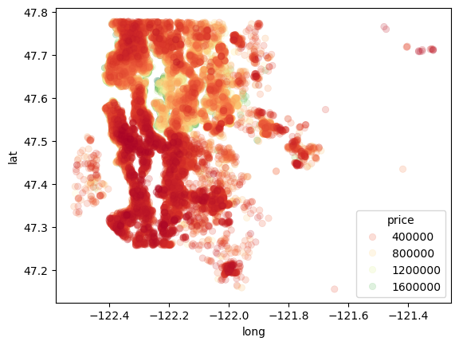
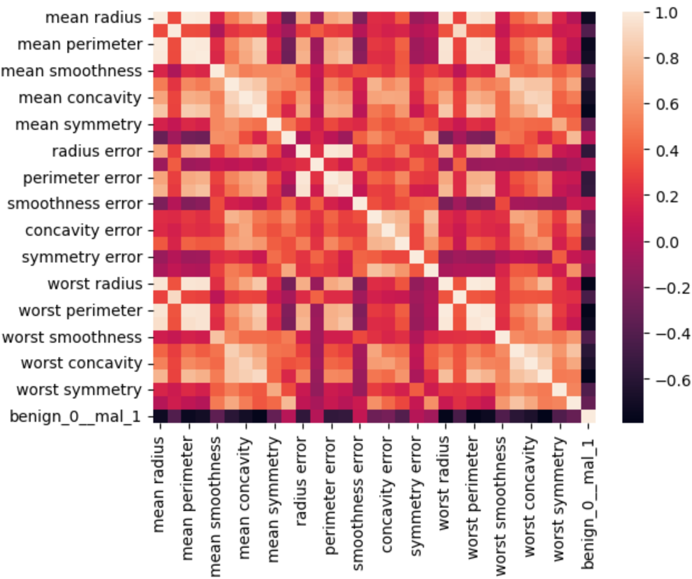
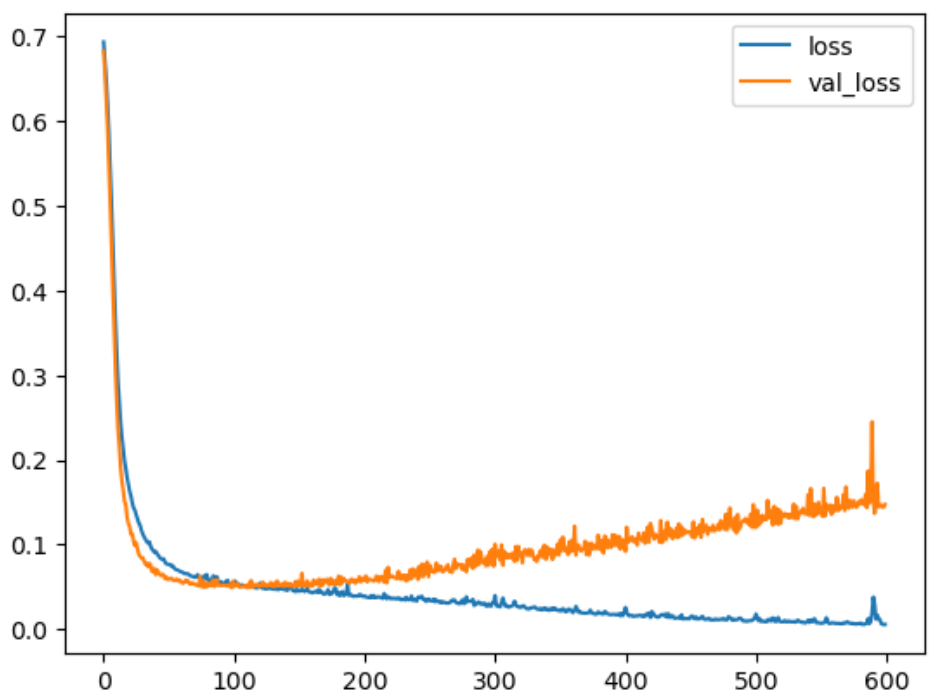
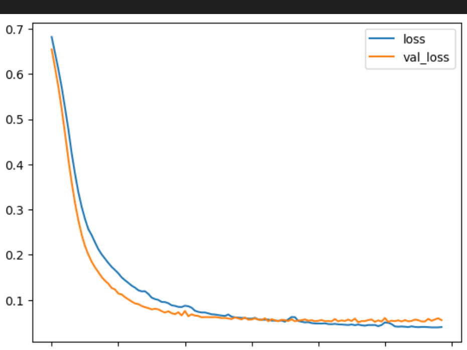
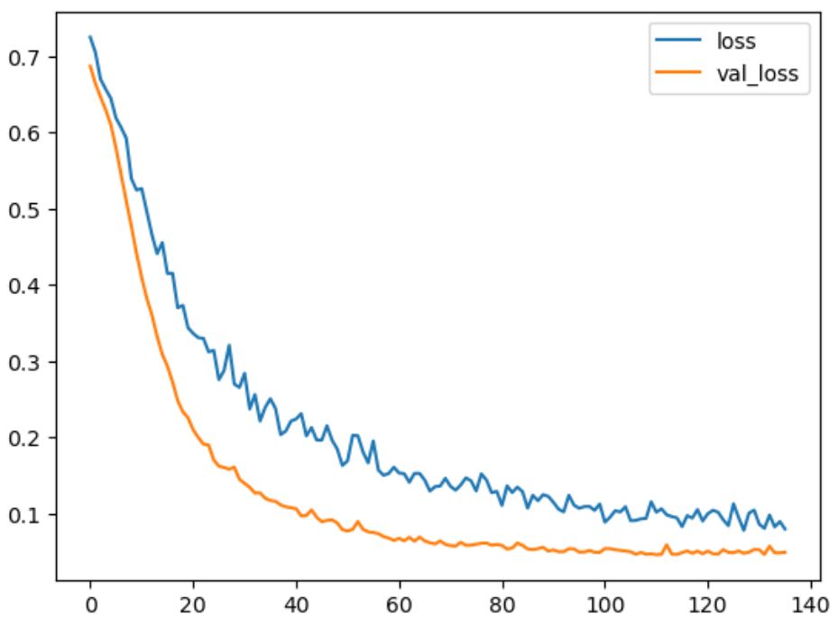
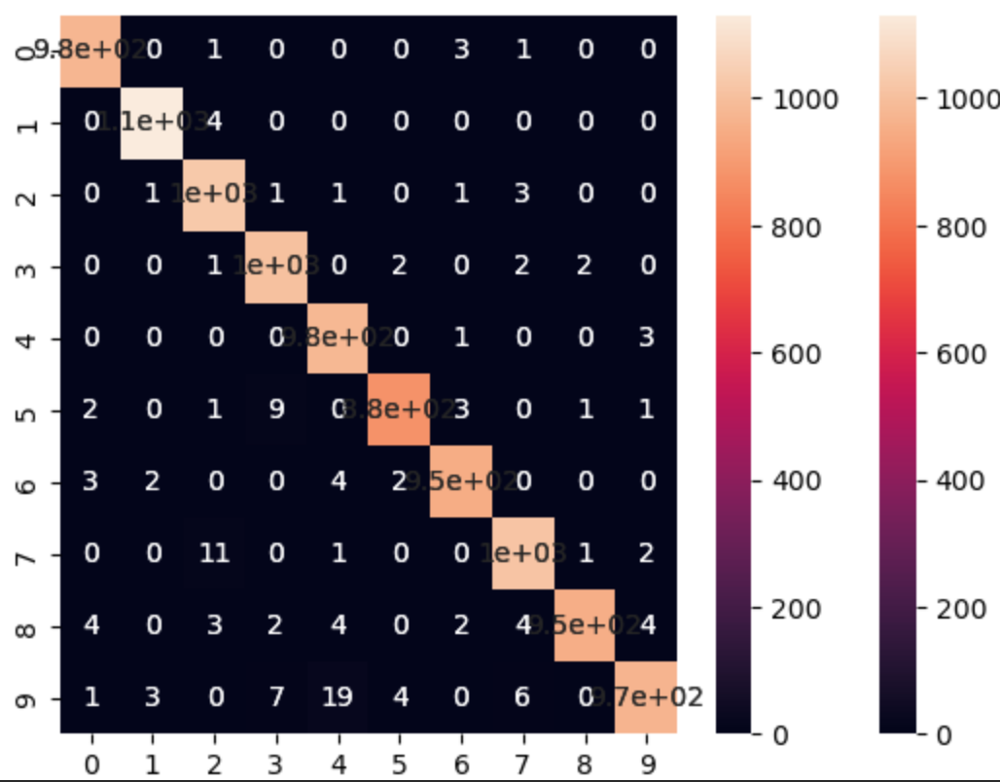
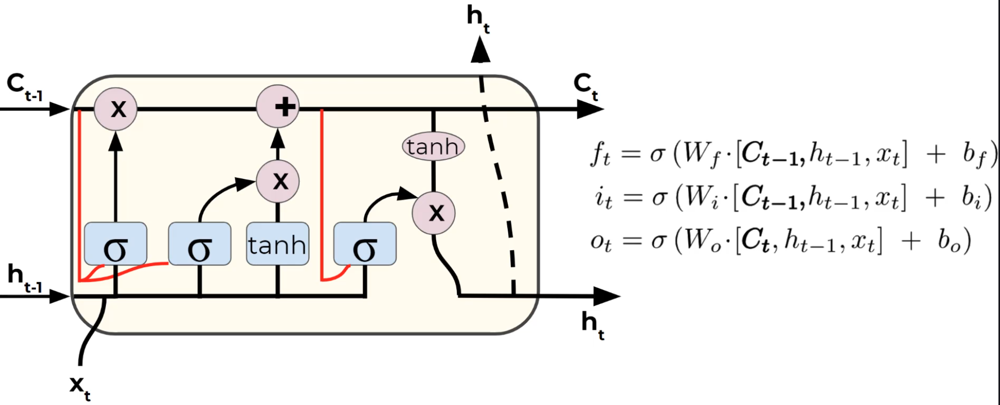
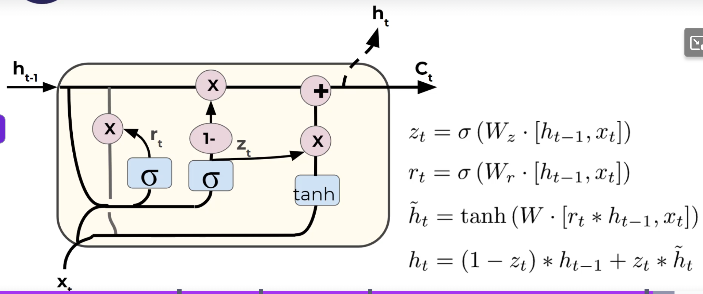

## Complete Tensorflow 2 and Keras Deep Learning Bootcamp
- Instructor: Pierian Training

## Section 1: Course Overview, Installs, and Setup

### 1. Auto-Welcome Message

### 2. Course Overview
- No github repo

### 3. Course Setup and Installation
- `pip install tensorflow[and-cuda]`
  - If hash error is found, `pip cache purge` then repeat the install 
- When GPU memory is full: `export TF_GPU_ALLOCATOR=cuda_malloc_async`
- Running on CPU: `import os; os.environ["CUDA_VISIBLE_DEVICES"] = "-1"`

### 4. FAQ - Frequently Asked Questions
- https://drive.google.com/drive/folders/1rXrgUzzIdsyJ4xp05Suq7ioR5q1tOtFY

## Section 2: Course overview confirmation

### Quiz 1: PLEASE WATCH COURSE OVERVIEW LECTURE

## Section 3: NumPy Crash Course

### 5. Introduction to NumPy

### 6. NumPy Arrays

### 7. Numpy Index Selection

### 8. NumPy Operations

### 9. NumPy Exercises

### 10. Numpy Exercises - Solutions

## Sectin 4: Pandas Crash Course

### 11. Introduction to Pandas

### 12. Pandas Series

### 13. Pandas DataFrames - Part One

### 14. Pandas DataFrames - Part Two

### 15. Pandas Missing Data

### 16. GroupBy Operations

### 17. Pandas Operations

### 18. Data Input and Output

### 19. Pandas Exercises

### 20. Pandas Exercises - Solutions

## Section 5: Visualization Crash Course

### 21. Introduction to Python Visualization

### 22. Matplotlib Basics

### 23. Seaborn Basics
- https://seaborn.pydata.org

### 24. Data Visualization Exercises

### 25. Data Visualization Exercises - Solutions

## Section 6: Machine Learning Concepts Overview

### 26. What is Machine Learning?

### 27. Supervised Learning Overview
- Splitting data into 3 sets
  - Training data: model parameters
  - Validation data: hyperparameters
  - Test data: final performance metric

### 28. Overfitting
- Overfitting
  - Low error on training sets but higher error on test/validation sets
- Underfitting
  - Model doesn't capture the underlying trend of the data
  - Low variance but high bias
  - Model might be too simple

### 29. Evaluating Performance - Classification Error Metrics
- Accuracy: number of correct predictions made by the model divided by the total number of predictions
- Recall: ability of a model to find all the relevant cases within a dataset
  - The number of true positives / (the number of true positives + the number of false negatives)
- Precision: ability of a classification model to identify only the relevant data points
  - The number of true positives / (the number of true positives + the number of false positives)
- Recal expresses the abilty to find all relevant instances in a dataset while precision expresses the proportion of the relevant data
- F1 score: harmonic mean of precision and recall
  - It punishes extreme values
  - F1 = 2 \* (precision \* recall)/(precision + recall)

Confusion matrix |Predicted Positive |  Predicted Negative
----------------|-------------------|-----------
Actual Positive |  TP               | FN
Actual Negative |  FP               | TN

- When False Negative is good
  - Spam detection: A few spam mails (FN) reach your inbox than having legitimate emails (FP) blocked
  - Quality control if re-testing is expensive
  - Security when false alarm is expensive: Minimizing FPs (alerting on normal) is important than meassing a few actual threats (FN)
- When False Positive is good
  - Missing FN is far worse than FP
  - Detecing a rare but dangeerous disease whre missing a case (FN) is catastrophic

### 30. Evaluating Performance - Regression Error Metrics
- MAE
- MSE
- RMSE

### 31. Unsupervised Learning
- Clustering
- Anomaly detection
- Unsupervised learning
  - No historical data
  - Evaluation is much harder and more nuanced
  
## Section 7: Basic Artificial Neural Networks - ANNs

### 32. Introduction to ANN Section

### 33. Perceptron Model

### 34. Neural Networks

### 35. Activation Functions
- https://en.wikipedia.org/wiki/Activation_function

### 36. Multi-Class Classification Considerations
- Non-exclusive classes
  - A data point may have multiple classes/categories
- Mutually exclusive classes
  - Each data point has one class only
- One-hot encoding
  - Class values might be replaced as 0 or 1
  - Multiple classes will be a group of 0 and 1 (A=0, B=1, C=1, ...)


### 37. Cost Functions and Gradient Descent
- Cost function == loss function
  - How far from training data
- Deep learning
  - Cross-entropy is commonly used
  
### 38. Backpropagation

### 39. TensorFlow vs. Keras Explained
- TF2.0 by 2019
- Keras is a high-level python library that can use a variety of DL libraries underneath such as TensorFlow, CNTK, or Theano
- TF2.0 adopted Keras as the official API for TF
  - Keras is officially imported through TF

### 40. Keras Syntax Basics - Part One - Preparing the Data
```py
import pandas as pd
import numpy as np
import seaborn as sns
df = pd.read_csv('./tmp/DATA/fake_reg.csv')
df.head()
sns.pairplot(df)
from sklearn.model_selection import train_test_split
X = df[['feature1','feature2']].values # now numpy array
y = df['price'].values
X_train,X_test,y_train,y_test = train_test_split(X,y,test_size=0.3, random_state=42)
print(X_train.shape, X_test.shape, y_train.shape, y_test.shape) # (700, 2) (300, 2) (700,) (300,)
from sklearn.preprocessing import MinMaxScaler
scaler = MinMaxScaler()
scaler.fit(X_train) # find min/max in X_train
X_train = scaler.transform(X_train) # normalize data into (0,1)
X_test = scaler.transform(X_test)
```

### 41. Keras Syntax Basics - Part Two - Creating and Training the Model
```py
from tensorflow.keras.models import Sequential
from tensorflow.keras.layers import Dense
# help(Dense)
model = Sequential([Dense(4,activation='relu'),
                    Dense(4,activation='relu'),
                    Dense(4,activation='relu'),
                    Dense(1)]) # normal forward feed network
# Or
# model = Sequential()
# model.add(Dense(4,activation='relu'))
# model.add(Dense(4,activation='relu'))
# model.add(Dense(4,activation='relu'))
# model.add(Dense(1))
model.compile(optimizer='rmsprop', loss='mse')
model.fit(x=X_train,y=y_train, epochs=250)
loss_df = pd.DataFrame(model.history.history)
loss_df.plot()
```

### 42. Keras Syntax Basics - Part Three - Model Evaluation
```py
model.evaluate(X_test,y_test,verbose=0) # 24.938720703125
test_predictions = model.predict(X_test)
test_predictions = pd.Series(test_predictions.reshape(300,))
pred_df = pd.DataFrame(y_test,columns=['Test True y'])
pred_df = pd.concat([pred_df,test_predictions],axis=1)
pred_df.columns = ['Test True y', 'Model Predictions']
sns.scatterplot(x='Test True y',y='Model Predictions',data=pred_df)
```

```py
from sklearn.metrics import mean_absolute_error, mean_squared_error
mean_absolute_error(pred_df['Test True y'], pred_df['Model Predictions'])
# 3.999169962088374
df.describe()
'''
	     price	feature1	feature2
count	1000.000000	1000.000000	1000.000000
mean	498.673029	1000.014171	999.979847
std	93.785431	0.974018	0.948330
min	223.346793	997.058347	996.995651
25%	433.025732	999.332068	999.316106
50%	502.382117	1000.009915	1000.002243
75%	564.921588	1000.637580	1000.645380
max	774.407854	1003.207934	1002.666308
'''
mean_squared_error(pred_df['Test True y'], pred_df['Model Predictions'])**0.5
# 4.993868507757979
new_gem = [[998,1000]]
new_gem = scaler.transform(new_gem)
model.predict(new_gem)
from tensorflow.keras.models import load_model
model.save('my_gem_model.keras') # hdf5 format is deprecated
later_model = load_model('./my_gem_model.keras')
later_model.predict(new_gem)
```

### 43. Keras Regression Code Along - Exploratory Data Analysis
```py
import pandas as pd
import numpy as np
import matplotlib.pyplot as plt
import seaborn as sns
df = pd.read_csv('./tmp/DATA/kc_house_data.csv')
#df.isnull().sum() # find missing data
df.describe().transpose() # summary of statistics
# sns.countplot(df['bedrooms']) # this command hangs (?)
sns.scatterplot(x='price', y='sqft_living',data=df)
len(df) # 21597
non_top_1_perc = df.sort_values('price',ascending=False).iloc[216:]
sns.scatterplot(x='long',y='lat',data=non_top_1_perc, edgecolor=None,
                alpha=0.2, palette='RdYlGn', hue='price')
```


### 44. Keras Regression Code Along - Exploratory Data Analysis - Continued
```py
df = df.drop('id', axis=1)
df['date'] = pd.to_datetime(df['date'])
df['year'] = df['date'].apply(lambda date: date.year)
df['month'] = df['date'].apply(lambda date: date.month)
df.head()
df = df.drop('date',axis=1)
#df.columns
df = df.drop('zipcode',axis=1)
df['yr_renovated'].value_counts()
'''
yr_renovated
0       20683
2014       91
2013       37
2003       36
2005       35
        ...  
1948        1
1951        1
1959        1
1934        1
1944        1
Name: count, Length: 70, dtype: int64
'''
```

### 45. Keras Regression Code Along - Data Preprocessing and Creating a Model
```py
X = df.drop('price',axis=1).values
y = df['price'].values
from sklearn.model_selection import train_test_split
(X_train,X_test, y_train, y_test) = train_test_split(X, y, test_size=0.3, random_state=101)
from sklearn.preprocessing import MinMaxScaler
scaler = MinMaxScaler()
X_train = scaler.fit_transform(X_train)
X_test = scaler.transform(X_test)
from tensorflow.keras.models import Sequential
from tensorflow.keras.layers import Dense
X_train.shape # print(X_train.shape,y_train.shape)
model = Sequential()
model.add(Dense(19,activation='relu'))
model.add(Dense(19,activation='relu'))
model.add(Dense(19,activation='relu'))
model.add(Dense(19,activation='relu'))
model.add(Dense(1))
model.compile(optimizer='adam', loss='mse')
model.fit(x=X_train, y=y_train, 
          validation_data=(X_test,y_test), 
          batch_size=128,epochs=400)
```

### 46. Keras Regression Code Along - Model Evaluation and Predictions
```py
losses = pd.DataFrame(model.history.history)
losses.plot()
```

```py
from sklearn.metrics import mean_squared_error, mean_absolute_error, explained_variance_score
predictions = model.predict(X_test)
mean_squared_error(y_test,predictions) # 26908129254.45602
df['price'].describe()
'''
count    2.159700e+04
mean     5.402966e+05
std      3.673681e+05
min      7.800000e+04
25%      3.220000e+05
50%      4.500000e+05
75%      6.450000e+05
max      7.700000e+06
Name: price, dtype: float64
'''
explained_variance_score(y_test,predictions) # 0.7971297631273663
plt.scatter(y_test,predictions)
# predict the price of housing
single_house = df.drop('price',axis=1).iloc[0]
single_house = scaler.transform(single_house.values.reshape(-1,19))
model.predict(single_house) # array([[290116.72]], dtype=float32) # not matching well as the data is near outlier
```

### 47. Keras Classification Code Along - EDA and Preprocessing
- Early stopping: Keras can automatically stop training based on a loss condition on the validation data in the model.fit()
- Dropout layers: to turn off neurons to avoid overfitting
```py
import pandas as pd
import numpy as np
import matplotlib.pyplot as plt
import seaborn as sns
df = pd.read_csv('./tmp/DATA/cancer_classification.csv')
df.info()
'''
 #   Column                   Non-Null Count  Dtype  
---  ------                   --------------  -----  
 0   mean radius              569 non-null    float64
 1   mean texture             569 non-null    float64
 2   mean perimeter           569 non-null    float64
 3   mean area                569 non-null    float64
 4   mean smoothness          569 non-null    float64
 ...
'''
df.describe().transpose()
'''
	   count	mean	std	min	25%	50%	75%	max
mean radius	569.0	14.127292	3.524049	6.981000	11.700000	13.370000	15.780000	28.11000
mean texture	569.0	19.289649	4.301036	9.710000	16.170000	18.840000	21.800000	39.28000
mean perimeter	569.0	91.969033	24.298981	43.790000	75.170000	86.240000	104.100000	188.50000
mean area	569.0	654.889104	351.914129	143.500000	420.300000	551.100000	782.700000	2501.00000
mean smoothness	569.0	0.096360	0.014064	0.052630	0.086370	0.095870	0.105300	0.16340
...
'''
sns.heatmap(df.corr())
```

```py
X = df.drop('benign_0__mal_1',axis=1).values
y = df['benign_0__mal_1'].values
from sklearn.model_selection import train_test_split
X_train, X_test, y_train, y_test = train_test_split(X,y,test_size=0.25, random_state=42)
from sklearn.preprocessing import MinMaxScaler
scaler = MinMaxScaler()
X_train = scaler.fit_transform(X_train)
X_test = scalX = df.drop('benign_0__mal_1',axis=1).values
y = df['benign_0__mal_1'].values
from sklearn.model_selection import train_test_split
X_train, X_test, y_train, y_test = train_test_split(X,y,test_size=0.25, random_state=42)
from sklearn.preprocessing import MinMaxScaler
scaler = MinMaxScaler()
X_train = scaler.fit_transform(X_train)
X_test = scaler.transform(X_test)er.transform(X_test)
from tensorflow.keras.models import Sequential
from tensorflow.keras.layers import Dense, Dropout
X_train.shape # (426, 30)
```

### 48. Keras Classification - Dealing with Overfitting and Evaluation
```py
model = Sequential()
model.add(Dense(30,activation='relu'))
model.add(Dense(15,activation='relu'))
# binary classification
model.add(Dense(1,activation='sigmoid'))
model.compile(loss='binary_crossentropy', optimizer='adam')
model.fit(x=X_train,y=y_train,epochs=600,validation_data=(X_test,y_test))
losses = pd.DataFrame(model.history.history)
losses.plot()
```

- This shows a typical overfitting
```py
model = Sequential()
model.add(Dense(30,activation='relu'))
model.add(Dense(15,activation='relu'))
# binary classification
model.add(Dense(1,activation='sigmoid'))
model.compile(loss='binary_crossentropy', optimizer='adam')
from tensorflow.keras.callbacks import EarlyStopping
early_stop = EarlyStopping(monitor='val_loss',mode='min',verbose=1,patience=25)
model.fit(x=X_train,y=y_train,epochs=600,validation_data=(X_test,y_test),
          callbacks=[early_stop])
```
- This stops at 118 epochs
```bash
14/14 ━━━━━━━━━━━━━━━━━━━━ 0s 9ms/step - loss: 0.0402 - val_loss: 0.0555
Epoch 118: early stopping
```

```py
# adding dropout layers
from tensorflow.keras.layers import Dropout
model = Sequential()
model.add(Dense(30,activation='relu'))
model.add(Dropout(0.5)) # 50% drop
model.add(Dense(15,activation='relu'))
model.add(Dropout(0.5)) # 50% drop
# binary classification
model.add(Dense(1,activation='sigmoid'))
model.compile(loss='binary_crossentropy', optimizer='adam')
from tensorflow.keras.callbacks import EarlyStopping
early_stop = EarlyStopping(monitor='val_loss',mode='min',verbose=1,patience=25)
model.fit(x=X_train,y=y_train,epochs=600,validation_data=(X_test,y_test),
          callbacks=[early_stop])
# now stops at 136 epochs
model_loss = pd.DataFrame(model.history.history)
model_loss.plot()
```

```py
predictions = model.predict(X_test)
predictions = (predictions>0.5).astype("int32")
from sklearn.metrics import classification_report, confusion_matrix
print(classification_report(y_test,predictions))
'''
5/5 ━━━━━━━━━━━━━━━━━━━━ 0s 5ms/step 
              precision    recall  f1-score   support

           0       0.96      0.98      0.97        54
           1       0.99      0.98      0.98        89

    accuracy                           0.98       143
   macro avg       0.98      0.98      0.98       143
weighted avg       0.98      0.98      0.98       143
'''
print(confusion_matrix(y_test,predictions))
'''
[[53  1]
 [ 2 87]]
'''
```

### 49. TensorFlow 2.0 Keras Project Options Overview

### 50. TensorFlow 2.0 Keras Project Notebook Overview

### 51. Keras Project Solutions - Exploratory Data Analysis

### 52. Keras Project Solutions - Dealing with Missing Data

### 53. Keras Project Solutions - Dealing with Missing Data - Part Two

### 54. Keras Project Solutions - Categorical Data

### 55. Keras Project Solutions - Data PreProcessing

### 56. Keras Project Solutions - Creating and Training a Model

### 57. Keras Project Solutions - Model Evaluation

### 58. Tensorboard

## Section 8: Convolutional Neural Networks - CNNs

### 59. CNN Section Overview

### 60. Image Filters and Kernels
- An image filter is essentially an image kernel
  - Blur filter: [ 0.0625 0.125 0.0625; 0.125 0.25 0.125; 0.0625 0.125 0.0625]
  - Caculates over 3x3 (or 4x4 or 5x5 or ...) neighboring cells then sums up  

### 61. Convolutional Layers
- Not all layers are connected
  - Local connectivity

### 62. Pooling Layers
- Accepts convolutional layers as input
- Max pooling: on window of 2x2 with stride 2, selects max only

### 63. MNIST Data Set Overview
- 60,000 training images
- 10,000 test images
- One hot encoding
  - Instead of 0,1,2,3 ...
  - 0 => [1, 0, 0, 0,0,0, 0,0,0, 0]
  - 1 => [0, 1, 0, 0,0,0, 0,0,0, 0]
  - 2 => [0, 0, 1, 0,0,0, 0,0,0, 0]


### 64. CNN on MNIST - Part One - The Data
```py
import pandas as pd
import numpy as np
import matplotlib.pyplot as plt
%matplotlib inline
from tensorflow.keras.datasets import mnist
(x_train, y_train), (x_test, y_test) = mnist.load_data()
x_train.shape # (60000, 28, 28)
single_image = x_train[0]
plt.imshow(single_image)
plt.show()
from tensorflow.keras.utils import to_categorical
y_train.shape #(60000,)
y_example = to_categorical(y_train) # one hot encoding
y_example.shape # (60000, 10) 
print(y_train[0], y_example[0]) # 5 [0. 0. 0. 0. 0. 1. 0. 0. 0. 0.]
y_cat_test = to_categorical(y_test, num_classes=10)
y_cat_train = to_categorical(y_train,10)
x_train = x_train/255.
x_test = x_test/255.
scaled_image = x_train[0]
# batch_size, width, height, color_channels
x_train = x_train.reshape(60000,28,28,1)
x_test = x_test.reshape(10000,28,28,1)
```

### 65. CNN on MNIST - Part Two - Creating and Training the Model
```py
from tensorflow.keras.models import Sequential
from tensorflow.keras.layers import Dense,Conv2D,MaxPool2D,Flatten
model = Sequential()
model.add(Conv2D(filters=32,kernel_size=(4,4),
          input_shape=(28,28,1),activation='relu'))
model.add(MaxPool2D(pool_size=(2,2)))          
model.add(Flatten())
model.add(Dense(128,activation='relu'))
# Output layer - multi-class
model.add(Dense(10,activation='softmax'))
model.compile(loss='categorical_crossentropy', optimizer='adam',
              metrics=['accuracy'])
from tensorflow.keras.callbacks import EarlyStopping
early_stop = EarlyStopping(monitor='val_loss', patience=1)
model.fit(x_train,y_cat_train, epochs=10,validation_data=(x_test,y_cat_test),
          callbacks=[early_stop])
```
- Stopped at 4 epochs

### 66. CNN on MNIST - Part Three - Model Evaluation
```py
model.evaluate(x_test, y_cat_test, verbose=0) # [0.04390735179185867, 0.9866999983787537]
from sklearn.metrics import classification_report, confusion_matrix
predictions = model.predict(x_test)
predictions = np.argmax(predictions,axis=1) 
print(classification_report(y_test,predictions))
'''
313/313 ━━━━━━━━━━━━━━━━━━━━ 0s 1ms/step
              precision    recall  f1-score   support

           0       0.99      0.99      0.99       980
           1       0.99      1.00      1.00      1135
           2       0.98      0.99      0.99      1032
           3       0.98      0.99      0.99      1010
           4       0.97      1.00      0.98       982
           5       0.99      0.98      0.99       892
           6       0.99      0.99      0.99       958
           7       0.98      0.99      0.98      1028
           8       1.00      0.98      0.99       974
           9       0.99      0.96      0.97      1009

    accuracy                           0.99     10000
   macro avg       0.99      0.99      0.99     10000
weighted avg       0.99      0.99      0.99     10000
'''
import seaborn as sns
sns.heatmap(confusion_matrix(y_test,predictions),annot=True)
plt.show()
```

```py
# Standalone prediction for a single image data
my_number = x_test[0]
plt.imshow(my_number)
#plt.show()
predictions[0] # np.int64(7)
np.argmax(model.predict(my_number.reshape(1,28,28,1))) # np.int64(7)
```

### 67. CNN on CIFAR-10 - Part One - The Data
- 32x32 images of 10 different objects
```py
import pandas as pd
import numpy as np
import matplotlib.pyplot as plt
%matplotlib inline
from tensorflow.keras.datasets import cifar10
(x_train,y_train),(x_test,y_test) = cifar10.load_data()
x_train.shape # (50000, 32, 32, 3)
x_train[0].max() # np.uint8(255)
x_train = x_train/255
y_test = x_test/255
from tensorflow.keras.utils import to_categorical
y_cat_train = to_categorical(y_train,10) # one-hot encoding
y_cat_test = to_categorical(y_test,10)
print(y_train[0],y_cat_train[0]) # [6] [0. 0. 0. 0. 0. 0. 1. 0. 0. 0.]
model=Sequential()
model.add(Conv2D(filters=32,kernel_size=(4,4),
          input_shape=(32,32,3),activation='relu'))
model.add(MaxPool2D(pool_size=(2,2)))          
model.add(Conv2D(filters=32,kernel_size=(4,4),
          input_shape=(32,32,3),activation='relu'))
model.add(MaxPool2D(pool_size=(2,2)))          
model.add(Flatten())
model.add(Dense(256,activation='relu'))
model.add(Dense(10,activation='softmax'))
model.compile(loss='categorical_crossentropy',optimizer='adam',
              metrics=['accuracy'])
model.summary()              
'''
┏━━━━━━━━━━━━━━━━━━━━━━━━━━━━━━━━━┳━━━━━━━━━━━━━━━━━━━━━━━━┳━━━━━━━━━━━━━━━┓
┃ Layer (type)                    ┃ Output Shape           ┃       Param # ┃
┡━━━━━━━━━━━━━━━━━━━━━━━━━━━━━━━━━╇━━━━━━━━━━━━━━━━━━━━━━━━╇━━━━━━━━━━━━━━━┩
│ conv2d_2 (Conv2D)               │ (None, 29, 29, 32)     │         1,568 │
├─────────────────────────────────┼────────────────────────┼───────────────┤
│ max_pooling2d_2 (MaxPooling2D)  │ (None, 14, 14, 32)     │             0 │
├─────────────────────────────────┼────────────────────────┼───────────────┤
│ conv2d_3 (Conv2D)               │ (None, 11, 11, 32)     │        16,416 │
├─────────────────────────────────┼────────────────────────┼───────────────┤
│ max_pooling2d_3 (MaxPooling2D)  │ (None, 5, 5, 32)       │             0 │
├─────────────────────────────────┼────────────────────────┼───────────────┤
│ flatten_2 (Flatten)             │ (None, 800)            │             0 │
├─────────────────────────────────┼────────────────────────┼───────────────┤
│ dense_4 (Dense)                 │ (None, 256)            │       205,056 │
├─────────────────────────────────┼────────────────────────┼───────────────┤
│ dense_5 (Dense)                 │ (None, 10)             │         2,570 │
└─────────────────────────────────┴────────────────────────┴───────────────┘
Total params: 225,610 (881.29 KB)
 Trainable params: 225,610 (881.29 KB)
 Non-trainable params: 0 (0.00 B)
'''
from tensorflow.keras.callbacks import EarlyStopping
early_stop = EarlyStopping(monitor='val_loss', patience=2)
model.fit(x_train,y_cat_train, epochs=15, batch_size=1,
        validation_data=(x_test,y_cat_test), callbacks=[early_stop])
## Memory error at 2GB GPU memory - even with batch_size=1
## Failed copying input tensor from /job:localhost/replica:0/task:0/device:CPU:0 to /job:localhost/replica:0/task:0/device:GPU:0 in order to run _EagerConst: Dst tensor is not initialized.    
```
- CPU run: 16GB is not large enough even with batch_size=1
- GPU run: 2GB is not large enough even with batch_size=1

### 68. CNN on CIFAR-10 - Part Two - Evaluating the Model

### 69. Downloading Data Set for Real Image Lectures

### 70. CNN on Real Image Files - Part One - Reading in the Data
- Images have different dimensions
  - Must be resized all
  - 130x130

### 71. CNN on Real Image Files - Part Two - Data Processing
```py
import pandas as pd
import numpy as np
import seaborn as sns
import matplotlib.pyplot as plt
from matplotlib.image import imread
import os
data_dir = './cell_images'
test_path = data_dir + '/test'
train_path = data_dir + '/train'
os.listdir(test_path) # ['parasitized', 'uninfected']
from tensorflow.keras.preprocessing.image import ImageDataGenerator
image_gen = ImageDataGenerator(rotation_range=20, 
                              width_shift_range=0.1,
                              height_shift_range=0.1,
                              shear_range=0.1,
                              zoom_range=0.1,
                              horizontal_flip=True,
                              fill_mode='nearest')
image_gen.flow_from_directory(train_path)
```

### 72. CNN on Real Image Files - Part Three - Creating the Model
```py
from tensorflow.keras.models import Sequential
from tensorflow.keras.layers import Dense,Conv2D,MaxPool2D,Flatten,Dropout
model=Sequential()
model.add(Conv2D(filters=32,kernel_size=(3,3),input_shape=(130,130,3),activation='relu'))
model.add(MaxPool2D(pool_size=(2,2)))
model.add(Conv2D(filters=64,kernel_size=(3,3),input_shape=(130,130,3),activation='relu'))
model.add(MaxPool2D(pool_size=(2,2)))
model.add(Conv2D(filters=64,kernel_size=(3,3),input_shape=(130,130,3),activation='relu'))
model.add(MaxPool2D(pool_size=(2,2)))
model.add(Flatten())
model.add(Dense(128,activation='relu'))
model.add(Dropout(0.5))
model.add(Dense(1,activation='sigmoid'))
model.compile(loss='binary_crossentropy', optimizer='adam',
              metrics=['accuracy'])
from tensorflow.keras.callbacks import EarlyStopping
early_stop = EarlyStopping(monitor='val_loss',patience=2)
batch_size=16
train_image_gen = image_gen.flow_from_directory(train_path,
                                                target_size=(130,130),
                                                color_mode='rgb',
                                                batch_size=batch_size,
                                                class_mode='binary')
test_image_gen = image_gen.flow_from_directory(test_path,
                                                target_size=(130,130),
                                                color_mode='rgb',
                                                batch_size=batch_size,
                                                class_mode='binary')
results = model.fit(train_image_gen,epochs=20,
                    validation_data=test_image_gen,
                    callbacks=[early_stop] )
from tensorflow.keras.models import load_model
model2 = load_model('./tmp/04-CNNs/malaria_detector.h5') # version mismatch?
```

### 73. CNN on Real Image Files - Part Four - Evaluating the Model

### 74. CNN Exercise Overview

### 75. CNN Exercise Solutions

## Section 9: Recurrent Neural Networks - RNNs

### 76. RNN Section Overview

### 77. RNN Basic Theory
- Examples of sequences
  - Time series data
  - Sentences
  - Audio
  - Car trajectories
  - Music
- Recurrent neuron
  - Sends output back to itself
- Cells that are a function of inputs from previous time steps are known as memory cells
- RNN are also flexible in their inputs and outputs, for both sequences and single vector values
- A basic RNN has a major disadvantages - only remember the previous output
  - No memory of long history but short term history only

### 78. Vanishing Gradients
- As networks grow deeper and more complex, we have 2 issues:
  - Exploding gradients: in back-propagation, gradients explode on the way back
  - Vanishing gradients: as you go back to the lower layers in back-propagation, gradients often get smaller, eventuallly causing weights to never change at lower levels
- Solutions
  - Gradient clipping
  - Leaky activation function
  - Batch normalization

### 79. LSTMS and GRU
- How to implement long-term memory
- LSTM
  - Four components
    - Forget gate
    - Input gate
    - Update gate
    - Output gate
  - Gates optionally let information through (like sigmod)    

- Gated Recurrent Unit (GRU)


### 80. RNN Batches
- For a given time series: [0,1,2,3,4,5,6]
  - Train data; [0,1,2,3]
  - Predict [4,5,6]
- How long the train data should be?

### 81. RNN on a Sine Wave - The Data

### 82. RNN on a Sine Wave - Batch Generator

### 83. RNN on a Sine Wave - Creating the Model

### 84. RNN on a Sine Wave - LSTMs and Forecasting

### 85. RNN on a Time Series - Part One

### 86. RNN on a Time Series - Part Two

### 87. RNN Exercise

### 88. RNN Exercise - Solutions

### 89. Bonus - Multivariate Time Series - RNN and LSTMs

    16min

### 90. Introduction to NLP Section
### 91. NLP - Part One - The Data
### 92. NLP - Part Two - Text Processing
### 93. NLP - Part Three - Creating Batches
### 94. NLP - Part Four - Creating the Model
### 95. NLP - Part Five - Training the Model
### 96. NLP - Part Six - Generating Text

    9min

### 97. Introduction to Autoencoders
### 98. Autoencoder Basics
### 99. Autoencoder for Dimensionality Reduction
### 100. Autoencoder for Images - Part One
### 101. Autoencoder for Images - Part Two - Noise Removal
### 102. Autoencoder Exercise Overview
### 103. Autoencoder Exercise - Solutions

    11min

### 104. GANs Overview
### 105. Creating a GAN - Part One- The Data
### 106. Creating a GAN - Part Two - The Model
### 107. Creating a GAN - Part Three - Model Training
### 108. DCGAN - Deep Convolutional Generative Adversarial Networks

    7min

### 109. Introduction to Deployment
### 110. Creating the Model
### 111. Model Prediction Function
### 112. Running a Basic Flask Application
### 113. Flask Postman API
### 114. Flask API - Using Requests Programmatically
### 115. Flask Front End
### 116. Live Deployment to the Web
