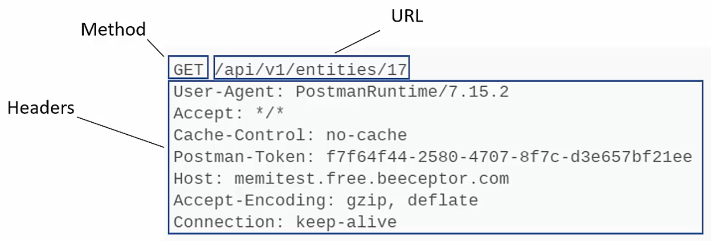
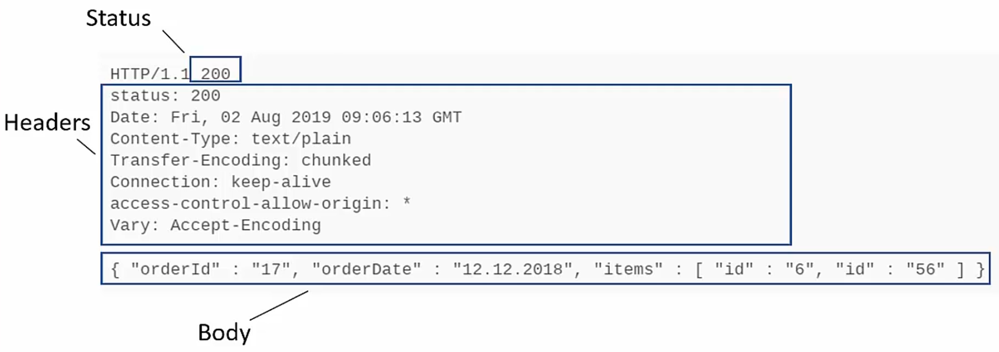
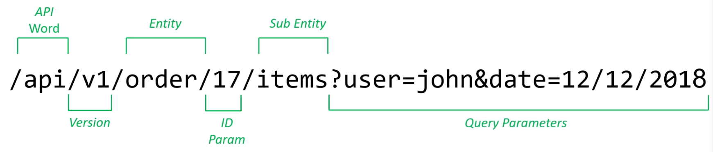

## REST API vs GraphQL vs gRPC - The Complete Guide
- Instructor: Memi Lavi

## Section 1: Welcome

### 1. Course Introduction
- The most popular Web APIs
- Which one to use
- Pros and Cons

### 2. Join the Software and Cloud Architect Community

### 3. Get the course slides

### 4. Who Is This Course For

### 5. Agenda

## Section 2: API Basics

### 6. What is an API?
- Application Programming Interface
- Hidden to users

### 7. API Types
- Operating system
  - a.exe interacts with OS API such as:
    - File system
    - Network devices
    - User interface elements
- Library
  - my.so interacts with other libraries
  - Class library like .NET, JAVA
- Remote
  - B/w computers connected with network
  - Proprietary protocol
  - Computers must be same platform
  - Ex: DCOM, .NET remoting, JAVA RMI
- Web
  - Any platform/OS/Language
  - Standard protocol through web interface

### 8. Importance of API
- Extend your reach
  - By exposing API, other apps can use your data

### 9. Why do you need a well-designed API?

## Section 3: Web API

### 10. Web APIs
- An API exposed by a web component
- Common characteristics of WEB API
  - Platform agnostic
  - Standard protocol of HTTP
  - Usually Request/Response based
- Web API types can be differentiated by:
  - Request Format
  - Request Contents
  - Response Format
  - Response Contents
- Web API types
  - SOAP
  - REST
  - GraphQl
  - gRPC

### 11. SOAP
- Simple Object Access Protocol by 1998
- XML based
- RPC style
- Extensible
- Outdated
- Do not use, unless have to

### 12. Other Web API types
- REST API
- Graph QL
- gRPC

## Section 4: REST API

### 13. What is REST?
- REpresentational State Transfer
- REST API enables the transfer of representation of a resource's state
- REST Request/Response
  - A client sends Request for resource's state to a server
    - State:
      - The current resource properties
      - Result of an action on the resource
    - Like "order no.17"
  - The server responds with the resource's state representation
    - Like order no.17 states
    - Usually JSON format
- Another example:
  - A client requests to delete a resource
  - The server responds with the resource's state representation (resource deleted)
- In HTTP standars:
  - A client sends request as "GET /api/order/17"
  - The server responds as "200 OK, JSON"

### 14. REST API Request
- Method: HTTP Verb (GET, POST, PUT, DELETE, ...)
- URL: location of the resource + parameters
- Headers: Meta-data of the request (user agent ...)
- Body: Contents of the request (optional)
- Structure of REST API Request


### 15. REST API Response
- Status code: 200(success), 404(Not found), ...
- Headers: Meta-data of the response (content type)
- Body: contents of the response (optional)
- Structure of REST API Response

- Usually JSON
- Can be XML or HTML

### 16. HTTP Verbs
- Set the action to be performed
  - Retrieve a resource
  - Add a resource
  - Update a resource
  - Delete a resource
- GET verb
  - Used to retrieve resources
  - Never use to add/update/delete resources
  - The default verb of the browser's address bar
  - Usually combined with parameters
  - Should not include body
- POST verb
  - To add resource
  - Should contain a message body that specifies the resource to be added
  - Should not contain query string parameters
  - Ex: `POST /api/entity?company=15`
- PUT verb
  - To modify resources
  - Should contain a message body that specifies the resource to be modified
  - Should not contain query string parameters
  - Ex: `PUT /api/entity?company=15`
- DELETE verb
  - To delete resoruces
  - Never use it to add/update/retrieve resources
  - Almost always combined with parameters
  - Should not include body

Verb | Role | Body? | Params In... 
-----|------|-------|--------------
GET  | Retrieve resource | No | URL
POST | Add resource | Yes | Body
PUT  | Modify resource | Yes |Body
DELETE | Delete resource |No | URL

### 17. URL Structure
- Defines the structure of the API's URL
- Must be:
  - Self explanatory
  - Consistent across the API
  - Predictable
- General guidelines
  - No Verbs  
  - Include API version
  - Use ID param to indicate a specific entity to work with
  - No long phrases
- Example:

    
### 18. Response Codes
- Notifies clients about the status of the request
  - Did it succeed?
  - Did it fail? Why?
  - What kind of error?
- Most clients check for response code and act accordingly
- Monitoring tools check response codes and report it
- Makes the API easier to use and understand
- Very easy to implement but often overlooked
- Response code groups
  - 1xx: Informational Response - do not use!!!
  - 2xx: Success
  - 3xx: Redirection - low level response
  - 4xx: Client Errors
  - 5xx: Server Errors
- Common response codes
  - 200: OK
  - 201: Created
  - 202: Accepted
  - 400: Bad request - parameters are invalid
  - 401: Unauthorized - we don't know who you are
  - 403: Forbidden - we know who you are and do not allow
  - 404: Not Found
  - 500: Internal Server Error

### 19. Versioning
- Why versioning is necessary
  - Your API will be updated
  - You don't control your clients
  - You can't force version upgrade to clients
- Set version support policy
  - Declare API end-of-life
- Include versioning in the API
- Version can come in 3 forms
  - In the URL
  - In a Header
  - In a Query Parameter
- Where to use?
  - Header is the most correct form
    - Adheres to the REST principles
  - But URL is the most common and easiest to implement
  - DO NOT use Query Params

### 20. HATEOAS
- Hypermedia As the Engine of Application State
- Each REST request returns related resources
- Client should not have prior knowledge about other resources
- Example:
  - Genie API: https://netflix.github.io/genie/

### 21. DEMO - REST API
- https://api.agify.io?name=memi
- In the browser, open developer tools then click Network


### 22. Summary
- REST API works with entities
- Based on the http protocol (verbs, response codes, URL)
- Request/response paradigm
- Easy to implement

## Section 5: GraphQL

### 23. Problems with REST
- Major problems with REST
  - Fixed entity structure
    - Client cannot specify the entity parts it wants to retrieve
    - The entity returned is set by the backend developer and cannot be modified on a per-query basis
    - Data page may have multiple field - With REST, there is no way to retrieve only the field we want. 
      - Increases load time and network latency
      - May need to create new entity types for specific queries
      - Bad maintenance
  - Request-response only
    - Modern web apps require more types of client-server communication
      - Notification from server without explicit request
    - Push notifications are becoming extremely useful
      - Can be implemented using
        - Polling
        - Web sockets
      - This is not part of REST

### 24. History of GraphQL
- Facebook developed GraphQL to replace REST API for internal use
  - Open sourced in 2015
  - Managed by GraphQL foundation

### 25. GraphQL Basics
- A specification (not implementation)
  - Defines the semantics and components of a GraphQL API
  - Does not provide concrete implementations
  - 3rd parties may develop implementations in many languages
- Defines structure of data returned
  - Can specify the parts of entity to return
  - Can specify related entities to be returned
  - Can specify filtering in the query
- JSON-based
  - Query sent to server in JSON
  - Data is returned in JSON
- 3 types of operations
  - Retrieve data
  - Write/change data
  - Subscribe to changes in data
- Schema-based
  - Defines the entities, fields and attributes
  - Operations are built on the schemar
```json
type Character{
  name: String!
  appearsIn: [Episode!]!
}
```  
- Cross-platform

### 26. Steps in Working with GraphQL
- Four main steps
  - Defining schema
  - Defining queries
  - Defining mutations and subscriptions (optional)
  - Implementing the logic
* Subscription: a design pattern where a client expresses interest in a topic, and the server sends updates when they occur
  - Subscription as push (not polling)
    - When the client subscirbes once, the server pushes data immediately when it becomes available
  - Subscription as pull (polling)
    - The client subscribes by sending a request but the server holds the request open until data is ready. Once the data is sent, the client immediately sends a new request, repeating the cycle

### 27. Role of the Schema
- With GraphQL, we can query specific fields
- GraphQL needs to check if there is such an object and such fields
- The schema:
  - Defines the shape of data
  - Defines queries
  - Defines mutations
  - Defines subscriptions
- GraphQL uses the schema to:
  - Validate queries
  - Provides auto complete
- Schemar type system
  - Field name
  - Fiedl type
  - Nullability
- Schema Definition Language
  - Defines the objects, fields, type system, queries and more
- The schema is somtimes autogenerated by the GraphQL

### 28. GraphQL Server Roles
- GraphQL server has following roles:
  - Defines GraphQL schema
  - Exposes GraphQL Endpoint
    - The endpoint is usually named 'graphql' and is accessed with POST verb
    - The server expects to receive JSON payload in this endpoint
  - Validate GraphQL operations
    - The server receives the JSON payload and validates it agains the schema
    - If a mismatch is found, the server returns a standard error message
    - No coding is required for this validation
  - Routes GraphQL operations to code
    - The server converts the JSON payload to objects and triggers methods to process the operations and return the data
    - These methods are called Resolvers
    - The server traverses through the query and runs a resolver for every field
    - Resolvers in the same hierarchy run in parallel
    - Do not assume that one will run before the other
    - Never use data from another resolver in your resolver
    
  - Returns GraphQL results
    - After running the resolvers and merging the results, the server converts the object to JSON and returns it to the client

### 29. DEMO - GraphQL
- https://studio.apollographql.com/public/star-wars-swapi/variant/current/explorer

### 30. Summary
- Works with entities
- Proprietary language
- Request/response + subscription
- Not so easy to implement

## Section 6: gRPC

### 31. Introduction
- The problems of REST API
  - Performance
    - Text based messaging and protocols
      - HTTP 1.1
      - JSON
    - Large packtes
    - Parsing required
  - Request-response only
    - Modern web apps require more types of client-server communication such as push notification
    - Polling/web sockets are not parts of the protocol
  - Limited syntax
    - REST was designed to run CRUD oeprations on entities

### 32. History of gRPC
- Main principles
  - Promotes messages and services, not objects and reference
  - Available on every popular platform
  - Free & open
  - Performant
  - Allows streaming

### 33. gRPC Basics
- Web API
  - Communication b/w 2 sides
- Based on HTTP/2
  - Fully compatible with HTTP/1.1
  - Allows streaming from both sides
  - Opens new possibilities such as push notifications and more
  - Note that due to the complex HTTP/2 handling in gRPC, it cannot be used from browsers
  - Mainly in native mobile apps and in the backend
- RPC style
- Multiple communication style
- Uses Protobuf as payload

### 34. RPC
- RPC style
  - Remote Procedure Call
  - Calling a method on the server from the client
    - REST calls an API, not actual method

### 35. Communication Styles
- Unary
  - Basically a request-response model
- Client streaming
  - The client opens a connection to the server
  - Sends continuous messages to the server
  - Great for telemetry, chats, etc
- Server streaming
  - The client opens a connection to the server
  - The server sends continuous messages using the connection
  - Great for notification, chat, etc
- Bi-directional
  - The client opens a connection to the server
  - Both the client and the server send continuous messages using the connection
  - Great for telemetry, chat, real-time data, etc

### 36. ProtoBuf
- Data format used by gRPC
- A binary format
- Declares message format in a .proto file
- Generates client code in supported languages
- A sample .proto file:
```protobuf
syntax = "proto3";
message SearchRequest {
  string query = 1;
  int32 page_number = 2;
  int32 results_per_page = 3;
}
```

### 37. Error Handling
- Extensive error handling information
  - Not based on built-in HTTP errors
- Some common status codes
  - CANCELLED: when a request is cancelled
  - DEADLINE_EXCEEDED: when a specified deadline is exceeded
  - UNAVAILABLE: the server is not available to handle the request
  - INTERNAL: an error occurred handling the in/out data
- https://grpc.io/docs/guides/error/#error-status-codes

### 38. Advanced Topics
- Channels
  - A definition of connection b/w client and server
  - Specifies the host and port
  - Has a state - connected, idle etc
  - Depends on the language
- Timeout/deadline
  - Specifies how long the client will wait to a reponse
    - Timeout: duration of time the client will wait
    - Deadline: a fixed point in time until which the client will wait
  - When exceeds, call is terminated and an error is returned
  - Specifiying timeout/deadline is language dependent
- Metadata
  - Information about a gRPC call
  - Ex: authentication details
  - Returned as a list of key-value pairs
  - Language dependentf  

### 39. DEMO - gRPC

### 40. Summary
- Works with actions
- Does not work with browsers
  - Needs native clients
- Request/response + streaming
- Not so easy to implement

## Section 7: Comparing Web APIs

### 41. Introduction

### 42. Pros and Cons

Feature  | REST | GraphQL | gRPC
----------|------|---------|------
Simplicity  | Y | N | N
Flexibility | N | Y | N
Performance | Y/N | N | Y
Push notification | N | Y | Y
Native browser support |Y |Y | N
Semantics | Entities | Entities | Actions

### 43. Flowchart for Selecting Web API
- Browser?
  - Y
    - Predefined entities?
      - Y      
        - Requires push notification?
          - Y: REST+ websockets
          - N: REST
      - N: GraphQL
  - N
    - Performance sensitive or streaming rquired?
      - Y: gRPC
      - N
        - Actions oriented?
          - Y: gRPC
          - N: go to Predefined entities? above
          
## Section 8: Conclusion

### 44. Conclusion

### 45. Bonus: Next Steps

