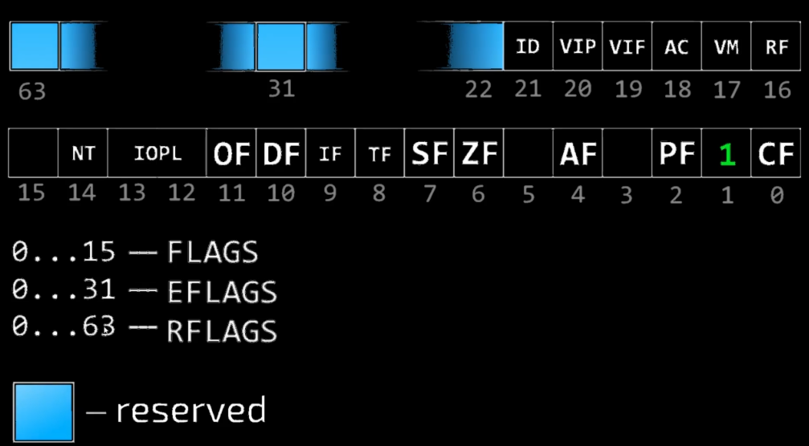

## Title: x86/x64 Assembly Language for Cybersecurity Maniacs
- Instructor: Dawid Farbaniec

## Section 1: The Basics

1. Why we should learn Windows x64 assembly?

2. Bits, Bytes and Words
- bit = 1 or 0
- bytes = 8 bits
- Word = 2 bytes (16bits)
- Double word = 2 words (32 bits)
- Quad words = 2 double words (64 bits)
- Oct word = 2 quad words (128 bits)

3. Binary and Hexadecimal
- binary: 11011b
- decimal: 27d
- Hexadecimal: 01Bh

4. Signed and Unsigned

5. Zero Extension and Sign Extension

6. Integer Overflow

7. Integer Saturation
- Just before over/underflow, make value as max/min
- Maintain value as max/min limit always to avoid any vulnerability

8. Byte Order (Endianness)
- Little endian vs Big endian

9. Difference b/w x86 and x64

10. Assembly and disassembly

11. Build Errors, Runtime Errors and Vulnerabilities

## Section 2: Intel64 and AMD64 Architecture

12. Operation Modes
- x64 has two operation modes
  - Long mode (64bit)
    - More Registers
    - More virtual memory
    - Widened registers
    - ...
  - Compatibilty mode (16/32bit support)
    - Real mode (16-bit)
    - Virtual 8086 mode
    - Protected mode (16/32bit)

13. General Purpose Registers


14. RFLAGS Register

- 0...15: FLAGS
- 0...31: EFLAGS
- 0...53: RFLAGS
- CF at 0: Carry flag. Mathematical operation
- PF at 2: Parity flag
- AF at 4: Auxilary flag
- ZF at 6: Zero flag
- SF at 7: Sign flag
- OF at 11: Overflow flag. Detects overflow

15. Instruction Pointer (RIP)
- IP: 0...15
- EIP: 0...31
- RIP: 0...63

16. Segment Registers
- DS: data segment
- ES: Extra data segment
- SS: Stack segment
- CS: code segment
- FS: Extra data segment
- GS: Extra data setgment

17. Floating Point Unit Registers
- 8 Registers
- Performs like stack

18. MultiMedia eXtensions Registers (MMX)
- 8 Registers of MM0...MM7
- Similar to SIMD

19. SSE/AVX/AVX-512 Registers


20. Flat Memory Model and Segmented Memory

21. The Stack
- Last in First out

22. Machine Code and Instruction Encoding
- Mnemonic: instructions in text form
- Operands: registers

## Section 3: Welcome to the World of Windows64 Assembly

23. Downloading MS Visual Studio

24. Setting Up MASM x64 and Visual Studio

25. MASM x64 Program code template
```asm
; commment here
.code ;code section
; 
Main proc; 
   ret; 
Main endp
end
```
- Ref: https://learn.microsoft.com/en-us/cpp/assembler/masm/microsoft-macro-assembler-reference?view=msvc-170

26. Running Our First MAXM x64 Program

27. Viewing Machine code of our first MASM x64 Program with PE-bear
- https://github.com/hasherezade/pe-bear
- PE file: file format in Windows like ELF in Linux

28. Debugging our first MASM x64 program with Visual Studio

29. Debugging our first MASM x64 Program with WinDbg
- WinDbg from MS store

30. Debugging our first MASM x64 Program with x64dbg

## Section 4: Introduction to MASM x64 syntax

31. Named Constants (EQU Directive)
```asm
IDOK EQU 1
MOV R8, 1    ; why 1? Hard to understand the code
MOV R8, IDOK ; better to understand
```
32. BYTE, SBYTE, and DB Directives

33. WORD, SWORD, and DW Directives

34. DWORD, SDWORD, and DD Directives

35. QWORD, SQWORD and DQ Directives

36. FWORD and DF Directives

37. TBYTE and DT Directives

38. OWORD Directive
- octword. 128bits

39. REAL4, REAL8, and REAL10 Directives

40. MMWORD Directive
- MultiMedia data

41. XMMWORD Directive

42. YMMWORD Directive

43. ZMMWORD Directive

44. Type Aliases (TYPEDEF Directive)
```asm
int64 typedef sqword
int32 typedef sdword
signed typedef sdword
unsigned typedef dword
float typdef real4
bool typdef byte
.const
FALSE equ 0
TRUE equ 1
.data
check bool FALSE
half float 0.5
num1 int64 12345
```

45. Named and Anonymous Labels
```asm
je _seven ; if equal them jump to _seven
jmp _eight ; if not, jump to _eight
_seven:
...
_eight:
...
```
- `@@`: anonymous label
  - `jmp @f`: jump forward
  - `jmp @b`: jump backward

46. Arrays

47. Text Strings

48. Structures

49. Unions

50. Nested Structures and Unions

51. Procedures and MS x64 Calling Convention

52. Macros


## Section 5: Basic x86/64 Processor Instructions

53. Data Transfer Instructions

54. Arithmetic Instructions
```asm
mov rax,1
add rax,7  ; add
mov rax, 8
mov rcx, 1
sub rax, rcx ; subtraction
mov rax,4
mov r8, -4
imul r8 ; signed multiply
mov rax, 2
mov rcx, 4
mul rcx ; unsigned multiply
mov r8, 1
inc r8 ; increment by one
dec r8 ; decrement by one
```

55. Logical Instructions

56. Shift and Rotate Instructions
- The last shifted out bit goes to Carry Flag

57. Control Flow Instructions

58. Stack Instructions

59. CPUID Instruction
- `cpuid`

60. Random Number Generator Instructions
- `rdrand rcx`

61. Calling Windows API Functions

62. Appying Code Size Optimizations

## Section 6: Understanding MultiMedia eXtensions (MMX)

63. Data Transfer with MMX instructions
```asm
movd mm0, myDword; movd - move doulbeword
movq mm1, myQword; movq - move quadword
mov rcx, offset mem64
movq mm1, mmword ptr [rcx]
```

64. Learning MMX Packed Arithmetic
```asm
movq mm0, mem64a
movq mm1, mem64b
paddb mm0, mm1; paddb - add packed byte integers
```

65. Learning MMX Logical and Shift Instructions
```asm
pand mm0, mm1; pand - bit wise packed logical and
por mm0, mm1; por - packed or
```

66. Learning MMX Comparison Instructions
```asm
pcmpeqb mm0, mm1; compare packed bytes for equal
```

## Section 7: Understanding Streaming SIMD Extensions (SSE)

67. Data Transfer with SSE Instructions
```asm
movups xmm0, mem128a; move four unaligned packed single precision floating point values b/w XMM registers or b/w XMM register and memory
movaps xmm1, xmm0; aligned version of movups
```
- movupd, movapd for double-precision

68. Learning Streaming SIMD Instructions
```asm
addps xmm0, xmm1; add packed single precision floating point
```

## Section 8: Understanding Advanced Vector eXtensions (AVX/AVX-512)

69. Learning Advanced Vector eXtensions (AVX/AVX-512)
- x86 core instruction example
  - xor r8, r8: xor 8bytes with single instruction
- avx-512 instruction example
  - vxorps zmm0, zmm1, zmm2: xor on 64 bytes with single instruction  

70. Laboratory: XORing Payload with AVX

## Section 9: Visual C++ and MASM x64 Assembly Hybrid Applications

71. Laboratory: Calling MASM x64 Procedures in Visual C++ Program
- Calling assembly function from C
```c
extern "C" int64_t my_procedure();
int main() {
  ...
}
```

72. Laboratory: Using Intrinsics in Visual C++ Program

## Section 10: Visual C#.NET and MASM x64 Assembly Hybrid Applications

73. Laboratory: Using MASM x64 Library in Visual C#.NET Program
- DllImport() in C#

74. Laboratory: Education AVX Calculator in Visual C#.NET and MASM x64

## Section 11: Emitting Instructions Opcodes in MASM x64

75. Laboratory: Sample Obfuscation and Deobfuscation in MASM x64

## Section 12: Self-Modifying Code in MASM x64

76. Laboratory: Execute Raw Bytes with Memory Erase

## Section 13: Using SYSCALL Instructions in MASM x64

77. Laboratory: Using SYSCALL Instruction in MASM x64

## Section 14: Sector Zero Corruptor Virus

78. Laboratory: Building Custom Bootloader Working in Real Mode


79. Laboratory: Corrupting Sector Zero of a Disk using Hexadecimal Editor
 
80. Laboratory: Executing Sector Zero Corruptor Virus

## Section 15: Legal

81. Legal
