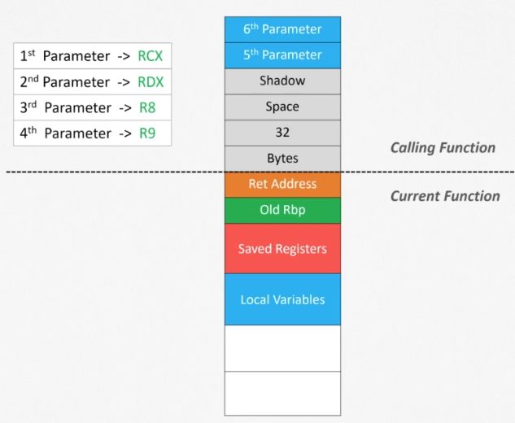

## Summary
- Title x86 64-bit Assembly Language: Step-by-Step Tutorial
- Instructor: x-BIT Development

## Section 1: Introduction

1. Introduction

## Section 2: Computer Achitecture

2. Introduction to Computer Architecture
- CPU - System Bus - memory/IO devices
- CPU structure
  - Registers
  - Control Unit: 
  - Arithmetic Logic Unit: addition/substraction
- Main Memory
  - MSB/LSB
  - Word: 2 Byte
  - Double Word: 4 Byte
  - Quad word: 8 Byte

3. Introduction to Processor Mode
- IA-32e Mode
  - 64-bit Mode
    - 64bit OS and 64bit programs
    - 16 64bit general purpose registers
    - 64bit flags register RFLAGS
    - 64bit instruction pointer RIP
    - 48bit virtual address support
  - Compatibility Mode
    - 16/32bit programs under 64bit OS
- General purpose register

| 64 bit | 32 bit | 16 bit | 8 bit  |
|--------|--------|--------|--------|
| RAX    | EAX    | AX     | AH AL  |
| RBX    | EBX    | BX     | BH BL  |
| RCX    | ECX    | CX     | CH CL  |
| RDX    | EDX    | DX     | DH DL  |
| RSI    | ESI    | SI     | SIL    |
| RDI    | EDI    | DI     | DIL    |
| R8     | R8D    | R8W    | R8B    |
| R9     | R9D    | R9W    | R9B    |
| R10    | R10D   | R10W   | R10B   |
| R11    | R11D   | R11W   | R11B   |
| R12    | R12D   | R12W   | R12B   |
| R13    | R13D   | R13W   | R13B   |
| R14    | R14D   | R14W   | R14B   |
| R15    | R15D   | R15W   | R15B   |
| RBP    | EBP    | BP     | BPL    |
| RSP    | ESP    | SP     | SPL    |

## Section 3: Data Representation

4. Number Systems
- Decimal
- Binary
- Hexadecimal

5. Representing Integers
- Unsigned numbers
- Signed numbers

6. ASCII Strings
- One character takes 1 byte

## Section 4: Assembly Language Basics

7. Install SASM

8. Assembling and Linking Basics
- source file -> object file by assembler -> executable by Linker

9. First Program
```assembly
; comments with semi-colon
%include "io64.inc"
section .data
var db 0  ; initializatio as zero
section .text  ; each section has its own purpose
global CMAIN
CMAIN:  ; this is LABEL. Case sensitive
   xor rax, rax
   ret
```
- Instructions
  - Label: CMAIN:
  - mnemonic: xor
  - operands: rax, rax
  - immediate value: registerse or memory address

10. Debugging
- test.as:
```assembly
counter dq 10
section .text
global main
main:
   mov rbp, rsp;
   mov rbx, 50
   mov [counter], rbx
   xor rax, rax
   ret
```
- Command to debug:
```bash
$ nasm -felf64 -g -F dwarf test.as -o test.o
$ gcc test.o -o a.out -no-pie
$ gdb ./a.out
...
(gdb) b test.as:6
Breakpoint 1 at 0x4000b0: file test.as, line 6.
(gdb) run
Starting program: /home/hpjeon/hw/class/udemy_x86-64/07/a.out 
```

11. Defining Variables
- In the section of .data, name - size - value
- [] to use the variable as a constant
- Casting is available `qword[sum]`
```assembly
section .data
; name size value
sum dq 20
section .text
global main
main:
   mov rax, qword[sum]
   xor rax, rax
   ret
```
- db: Define Byte. 8bits
- dw/WORD: Define Word. 2bytes or 16bits
- dd/DWORD: Define double words. 4bytes or 32bits
- dq/QWORD: Define quad words. 8bytes or 64bits

12. Constant
- `BufferSize equ 500`

## Section 5: x86-64 Assembly Language Notes

13. x86-64 Assembly Language Notes
- `xor rax, rax`: initialize rax
- Immediate value: given as number
```assembly
section .text
global main
main:
  mov rbp, rsp
  mov rax, 0x123456
  xor rbx,rbx
  add rbx, rax ; now rbx is 0x123456 or 100100011010001010110
  mov bl, 0    ; now rbx is 0x123400 or 100100011010000000000
  mov bx, 0    ; now rbx is 0x120000 or 100100000000000000000
  mov eax, 0   ; now rbx is 0x120000 or 100100000000000000000
  ret
```  
  - bl is the bottom 8bit of rbx (al for rax)
  - bx is the bottom 16bit of rbx
  - eax is the bottom 32bit of rbx
  - mov operands can change the bottom bits as shown above
- `add eax,200` will zero out upper 32bits of rax
- When using ah bh ch dh in an instruction, we can only use ah al bh bl ch cl dh dl at the same time.
  - `mov ah,dil` is invalid
- push and pop are 8 bytes 
  - 32bits don't work
  - `push/pop eax` will not work. `push/pop rax` works
  - Same for call/jmp
  - Or cast with qword: `call qword[func]`
  - 16bit register works `push ax` or `pop bx`

## Section 6: Data Transfer and Basic Arithmetic Instructions

14. mov instruction
```asm
section .data
books dd 10
counter dq 50
sum dq 30
variable 1
section .text
global main
main:
   mov rbp, rsp ; for correct debugging
  ; mov destination, source
  ; mov reg, imm
  mov rax, -1
  mov al,20
  mov rdx,15
  mov rbx, 7
  ; mov reg, reg  
  mov rax, rbx
  mov rcx, rax
  ; mov mem, imm
  mov dword[books], 20
  ; mov reg, mem
  ; mov mem, reg
  mov rax, qword[counter]
  mov [sum], rax
  ; mov 10, rax <= invalid
  ; mov [sum], [counter] <= invalid
  ; mov rax r10w <= invalid. Must be same size
  mov al, 256 ; this will overflow as zero
  mov qword[variable],100 ; when transferring an imm to a variable, the size must be casted
  xor rax,rax
  ret
```

15. xchg instruction
```asm
section .data
var dq 7
section .text
global main
main:
  mov rbp, rsp; for correct debugging. Uses rbp as local stack
  ; ref: https://stackoverflow.com/questions/64347410/why-is-the-mov-rbp-rsp-needed-at-the-end-of-a-function
  ; xchg reg, reg
  mov rax,5
  mov rdx,100
  xchg rax,rdx
  mov bx,20
  mov cx,3
  xchg bx,cx
  ; xchg reg, mem
  ; xchg mem, reg
  mov rcx,90
  xchg rcx,[var]
  ; xchg rax, cx <= invalid
  ; xchg cx, qword[var] <= invalid
  ; xchg [var], [sum] <= invalid
  xor rax,rax
  ret
```

16. A simple example
```asm
section .data
varA dq 0
varB dq 0
section .text
global main
main:
  ; assign 7 to var!
  mov qword[varA],7
  ; assign -1 to varB
  mov qword[varB],-1
  ; exchange varA and varB
  mov rax,[varA]  
  xchg [varA],[varB]
  mov [varA],rax
  xor rax,rax
  ret
```

17. inc and dec instructions
```asm
section .data
counter db 30
section .text
global main
main:
  ; inc reg
  mov r8,10
  inc r8
  mov rdx,100
  inc rdx
  ; inc mem
  ; inc counter -> invalid. will not compile
  inc byte[counter]
  ; dec reg
  dec r8
  dec rdx
  ; dec mem
  dec byte[counter]
  ; inc 8 -> invalid
  ; dec 10 -> invalid
  xor rax,rax
  ret
```

18. neg instruction
```asm
section .data
num dd 100
section .text
global main
main:
  mov rbp, rsp;
  ; neg reg
  mov rax, -10
  neg rax ; now +10
  mov rcx,0
  neg rcx ; still 0
  ; neg mem
  ; neg num <- invalid
  neg dword[num]
  xor rax,rax
  ret
```

19. add and sub instructions
```asm
section .data
sum dq 20
section .text
global main
main:
  mov rbp, rsp;
  ; add/sub destination,source
  ; add/sub reg,imm
  mov rax,10
  add rax,5
  sub rax,4
  ; add/sub reg,reg
  mov rbx,10
  mov rcx,20
  add rbx,rcx  ; now rbx 30
  sub rcx, rbx ; now rcx -10
  ; add/sub mem,imm
  add qword[sum],7
  sub qword[sum],20 ; now sum is 7
  ; add/sub reg,mem
  ; add/sub mem,reg
  mov rdx,100
  mov rcx,5
  add rdx,[sum] ; now rdx 107
  sub [sum],rcx ; now sum 2
  ; add  5,rax <- invalid
  ; sub 10,edx <- invalid
  ; add rax,cx <- invalid
  ; sub qword[sum],edx <- invalid. Must be same size
  ; add [sum],[score] <- invalid
  xor rax,rax
  ret
```

20. add and sub instructions example
```asm
section .data
varA dq 10
varA dq 20
varC dq 10
varD dq 30
result dq 0
section .text
global main
main:
  mov rbp, rsp;
  ; -varA+varB - (varC-varD)
  mov rax,[varA]
  neg rax
  add rax,[varB] ; -varA + varB
  mov rbx,[varC]
  sub rbx,[varD];
  sub rax,rbx
  mov [result],rax
  xor rax,rax
  ret
```

## Section 7: Flags

21. Flags Register
- The FLAGS register is the status register that contains the current state of a x86 CPU
- Ref: https://en.wikipedia.org/wiki/FLAGS_register


22. Carry Flag
- CF: detects unsigned overflow
- Will be triggered if negative number is made
```asm
section .data
section .text
global main
main:
  mov rbp, rsp;
  mov al,10
  add al,1
  ; no carry flag yet
  ; (gdb) p $al
  ; $2 = 11
  ; (gdb) p $eflags
  ; $3 = [ IF ]
  mov al,100
  add al,255
  ; now carry flag due to overflow -> but OF is not found because 255 is outside of [-128,127]
  ; (gdb) p $al
  ; $4 = 99
  ; (gdb) p $eflags
  ; $5 = [ CF PF AF IF ] <-- CF is found
  mov bl,20
  sub bl,30 ; now bl is -10, which is negative number
  ; (gdb) p $bl
  ; $3 = -10
  ; (gdb) p $eflags
  ; $4 = [ CF PF AF SF IF ]
  xor rax,rax
  ret
```

23. Overflow Flag
- OF: detects signed overflow
```asm
  mov al,100
  add al,30 ; now al is larger than 127 and overflows
```
- This yields OF as `(gdb) p $eflags; $3 = [ PF AF SF IF OF ]`

24. Sign Flag
- SF: detects negative number
```asm
section .data
section .text
global main
main:
  mov rax,30
  add rax,1
  ; (gdb) p $eflags
  ; $1 = [ IF ]
  mov rbx,30
  sub rbx,40
  ; (gdb) p $eflags
  ; $2 = [ CF PF SF IF ] -> SF is found as rbx is -10 now
  xor rax,rax
  ret
```

25. Zero Flag
```asm
section .data
section .text
global main
main:
  mov rbp, rsp;
  mov rbx,30
  sub rbx,30  ; now rbx is zero
  ; (gdb) p $eflags
  ; $2 = [ PF ZF IF ] <-- ZF is found
  xor rax,rax
  ret
```

## Section 8: Bitwise Instructions

26. and instruction

| x | y | x and y|
|---|---|:----:|
| 0 | 0 | 0 |
| 0 | 1 | 0 |
| 1 | 0 | 0 |
| 1 | 1 | 1 |

```asm
section .data
number dq 11001000b
var    dq 11010111b
section .text
global main
main:
  mov rbp, rsp;
  ; and destination, source
  ; and reg,imm
  mov rax, 10010001b
  and rax, 01110011b
  ; and reg,reg
  mov rbx,10001110b
  mov rcx,11111111b
  and rbx,rcx
  ; (gdb) p/t $rbx
  ; $6 = 10001110
  ;
  ; and mem,imm
  and qword[number],0
  ; (gdb) x &number
  ; 0x6000e8 <number>:      00000000000000000000000000000000
  ;
  ; and reg,mem
  ; and mem,reg
  and rax,[var]
  and [var], rbx
  ; and [number], [var] -> invalid
  xor rax,rax
  ret
```

27. or instruction

| x | y | x or y|
|---|---|:----:|
| 0 | 0 | 0 |
| 0 | 1 | 1 |
| 1 | 0 | 1 |
| 1 | 1 | 1 |

```asm
section .data
number dq 10001000b
var    dq 10000111b
section .text
global main
main:
  mov rbp, rsp;
  ; or destination, source
  ; or reg,imm
  mov rax, 11110001b
  or  rax, 11010001b
  ; or reg,reg
  mov rbx,10101000b
  mov rcx,11111111b
  or  rbx,rcx 
  ; or mem,imm
  or qword[number],0
  ; or reg,mem
  ; or mem,reg
  or rax,[var]
  or [var], rbx
  xor rax,rax
  ; or 200,rax <-- invalid
  ; or r10,dl  <-- invalid. Must be same size
  ; or [number],[var] <-- invalid
  ret
```

28. and/or instruction example
```asm
section .data
number dq 10001000b
var    dq 10000111b
section .text
global main
main:
  mov rbp, rsp;
  mov rax,10010110b
  and rax,01111011b ; now rax 10010
  mov rbx,11110001b
  and rbx,11001111b ; now rbx 11000001
  mov rcx,10001001b
  or  rcx,01000100b ; now rcx 11001101
  xor rax,rax
  ret
```

29. xor instruction

| x | y | x xor y|
|---|---|:----:|
| 0 | 0 | 0 |
| 0 | 1 | 1 |
| 1 | 0 | 1 |
| 1 | 1 | 0 |

- `xor rax,rax` initializes rax as 00000000
  - This is more efficent than `mov rax,0` as it doesn't require zero immediate. Only one register used
```asm
section .data
number dq 10111000b
var    dq 10110111b
section .text
global main
main:
  mov rbp,rsp;
  ; xor destination,source
  ; xor req,imm
  mov rax,10110101b
  xor rax,10010101b
  ; xor reg,reg
  mov rbx,10001000b
  mov rcx,11111111b
  xor rbx,rcx
  ; xor mem,imm
  xor qword[number],0
  ; xor reg,mem
  ; xor mem,reg
  xor rbx,[var]
  xor [var],rax
  xor rax,rax
  ; xor 100,rax <-- invalid
  ; xor r8,ebx  <-- invalid
  ; xor [number],[var] <-- invalid
  ret
```

30. flags example
```asm
section .data
number dq 10111000b
var    dq 10110111b
section .text
global main
main:
  mov rbp,rsp
  mov al,11100000b
  and al,0         ; this yields ZF
  ; (gdb) p $eflags
  ; $1 = [ PF ZF IF ]
  mov bl,10001000b
  or  bl,10000000b ; this yields SF
  ; (gdb) p $eflags
  ; $2 = [ PF SF IF ]
  xor rax,rax ; this yields ZF
  ; (gdb) p $eflags
  ; $3 = [ PF ZF IF ]
  ret
```

31. not instruction
```asm
section .data
number dq 11001000b
section .text
global main
main:
  mov rbp,rsp
  ; not reg
  mov al,11110001b
  not al
  ; not mem
  not byte[number]
  ; not 5 <-- invalid
  xor rax,rax
  ret
```

## Section 9: Branch Instructions

32. Introduction to Branching
- Unconditional Branch
- Conditional Branch
  - ZF,SF can control

33. jmp instruction
```asm
section .data
loc dq 0
section .text
global main
main:
  mov rbp,rsp
  ; jmp destination
  ; jmp label
  jmp end
  ; jmp reg
  mov rbx,end
  jmp rbx
  ; jmp mem
  mov qword[loc],end
  jmp qword[loc]
  ; jmp ebx <-- invalid. Must be 64bit 
  ; jmp word[loc] <-- invalid. Must be 64bit 
  mov rax,5
  add rax,10
end:
  xor rax,rax
  ret
```

34. test instruction
- Performs a bitwise AND on two operands, calling ZF or SF when found. No results are stored
```asm
section .data
loc dq 0
section .text
global main
main:
  mov rbp,rsp
  ; test reg,imm
  ; test reg,reg
  ; test mem,imm
  ; test reg,mem
  ; test mem,reg
  mov al,101011b
  test al, 1000b ; ZF is not found
  mov bl,10001100b
  test bl,   1001b ; ZF is not found
  mov bl,10000100b
  test bl,   1001b ; ZF is found
  ; (gdb) p $eflags
  ; $2 = [ PF ZF IF ]
  xor rax,rax
  ret
```

35. Conditional Branching part 1
```asm
section .data
loc dq 0
section .text
global main
main:
  mov rbp,rsp
  ; jz  destination if ZF is found
  mov rax,100
  sub rax,50 ; ZF is NOT triggered
  jnz zero   ; now goes to zero
  ; jnz destination if ZF is not found
  ; jc  destination if CF is found
  ; assume the above instructions are gone:
  mov bl,200
  mov bl,100 ; CF is triggered
  jc carry   ; now jumps to carry
  ; jnc destination if CF is not found
  ; jo  destination if OF is found
  ; assume the above instructions are gone:
  mov cl,-100
  sub cl,100  ; OF is triggered
  jo overflow ; now jumps to overflow
  ; jno destination if OF is not found
  ; js  destination if SF is found
  ; assume the above instructions are gone:
  mov dl,0
  or  dl,10000000b ; SF is triggered
  js sign          ; now jumps to sign
  ; jns destination if SF is not found
  mov r8,10
sign:
  xor rax,rax
  ret
overflow:
  xor rax,rax
  ret
carry:
  xor rax,rax
  ret
zero:
  xor rax,rax
  ret
```

36. Conditional Branching part 2
```asm
section .data
loc dq 0
section .text
global main
main:
  mov rbp,rsp
  ; cmp left operand, right operand;
  ; cmp reg,imm
  ; cmp reg,reg
  ; cmp mem,imm
  ; cmp reg,mem
  ; cmp mem,reg
  ; 
  ; cmp left operand,righ operand (unsigned numbers)
  ; ja/jnbe destination Left > Right
  mov rax,5
  cmp rax,1
  ja greater ; as 5>1, jumps to greater. jnb greater is same
  ; jae/jnb destination Left >= Right
  ; jb/jnae destination Left < Right
  ; assume that the above instructions are gone
  mov rbx,20
  cmp rbx,20
  jb less    ; as < failed, it does not jump
  ; jbe/jna destination Left <= Right
greater:
  xor rax,rax
  ret
less:
  xor rax,rax
  ret
```

37. Conditional Branching part 3
```asm
section .data
loc dq 0
section .text
global main
main:
  mov rbp,rsp
  ; cmp left operand, right operand;
  ; cmp reg,imm
  ; cmp reg,reg
  ; cmp mem,imm
  ; cmp reg,mem
  ; cmp mem,reg
  ; 
  ; cmp left operand,righ operand (signed numbers)
  ; jg/jnle destination Left > Right
  mov rax,20
  cmp rax,15
  jg greater ; as 20>15, jumps to greater. jnle greater is same
  ; jge/jnl destination Left >= Right
  ; jl/jnge destination Left < Right
  ; jle/jng destination Left <= Right
greater:
  xor rax,rax
  ret
less:
  xor rax,rax
  ret
```

38. Branching example 1
- if-else-endif
```asm
section .data
size dq  0
x    dq 10
y    dq  5
z    dq 10
section .text
global main
main:
  mov rbp,rsp
  ; if (x>y)
  ;    x = 100;
  ; else
  ;    y = 200;
  ; endif
if:
  mov rax,[x]
  cmp rax,[y]
  jle else
  mov qword[x],100
  jmp endif
else:
  mov qword[y],200
endif:
  xor rax,rax
  ret
```

39. Branching example 2
- while loop
```asm
section .data
x    dq 0
y    dq 10
section .text
global main
main:
  mov rbp,rsp
  ; while (x <=y)
  ;    x++;
  ; endwhile
while:
  mov rax,[x]
  cmp rax,[y]
  jg endwhile
  inc qword[x]
  jmp while
endwhile:
  xor rax,rax
  ret
```

40. Branching example 3
- In the above example, rax is updated after x++ is done
- We may do rax++ instead of x++, skipping redundancy
```asm
section .data
x    dq 0
y    dq 10
section .text
global main
main:
  mov rbp,rsp
  ; while (x <=y)
  ;    x++;
  ; endwhile
  mov rax,[x]  
  mov rbx,[y]
while:
  cmp rax,rbx
  jg endwhile
  inc rax
  jmp while
endwhile:
  mov [x],rax
  xor rax,rax
  ret
```

## Section 10: Array and Addressing Modes

41. Introduction to Array

42. Immediate Register and Direct Addressing
- Addressing mode
  - Immediate Addressing
    - mov rax,20
  - Register Addressing
    - mov rax, rbx
  - Direct Addressing
    - mov rax,[0x100]
    - mov al, [array+4]
  - Indirect Addressing
  - Rip-relative Addressing
- Sample direct addressing:
```asm
section .data
value db 1,2,3,4,5
v2    dd 1,2,3,4,5
section .text
global main
main:
  mov rbp,rsp
  mov al,[value+3] ; 0th->1,1st->2,2nd->3,3rd->4
  mov bl,[v2   +12]; dd has 4bits more and 4*3 = 12
  ; (gdb) p $al
  ; $1 = 4
  ; (gdb) p $bl
  ; $2 = 4
  xor rax,rax
  ret
```

43. Indirect Addressing
- A sample Direct Addressing
```asm
section .data
var dq 10,20,30,40,50,60,70,80
section .text
global main
main:
  mov rbp,rsp
  ; base+index*scale+displacement
  mov rsi,var
  mov rax,[rsi]
  mov rcx,2
  mov rbx,[rsi+rcx*8] ;=> rbx 30
  mov rbx,[rsi+16]    ;=> rbx 30
  mov rbx,[rsi+rcx*8+16]; =: rbx 50
  xor rax,rax
  ret
```
- Conversion to indirect
```asm
section .data
var dq 10,20,30,40,50,60,70,80
varSize equ $-var
varTypeSize equ 8
varCount equ varSize/varTypeSize
section .text
global main
main:
  mov rbp,rsp
  ; base+index*scale+displacement
  mov rsi,var
  mov rdx,varCount
  xor rcx,rcx
printvar:
  mov rax,[rsi+rcx*varTypeSize]
  PRINT_DEC 8, rax
  NEWLINE
  inc rcx
  cmp rcx,rdx
  jl printvar
  xor rax,rax
  ret
```
- PRINT_DEC is not recognized. TBD

44. Endianness
- Big Endian vs Little Endian
  - x86 processors use little-endian byte ordering
```asm
section .data
value dd 0x12345678
section .text
global main
main:
  mov rbp,rsp
  ; base+index*scale+displacement
  mov al,[value]
  mov bl,[value+1]
  mov cl,[value+2]
  mov dl,[value+3]
  ; (gdb) p/x $dl
  ; $3 = 0x12
  ; (gdb) p/x $cl
  ; $4 = 0x34
  ; (gdb) p/x $bl
  ; $5 = 0x56
  ; (gdb) p/x $al
  ; $6 = 0x78
  xor rax,rax
  ret
```

45. lea instruction
- Load Effective Address instruction
  - Does not change flags like CF or ZF
```asm
section .data
sum dq 10
section .text
global main
main:
  mov rbp,rsp
  ; base+index*scale+displacement
  mov rax,[sum]
  lea rbx,[sum]
  mov rcx,[rbx] ; now rcx 10
  lea rdx, [rax+10]; now rdx 20
  xor rax,rax
  ret
```  

46. Rip-relative addressing
```asm
section .data
data dq 100
section .text
global main
main:
  mov rbp,rsp
  mov rax,[rel data] ; now rax 100
  xor rax,rax
  ret
```
- Or use default rel below global main so all memory data are rel

## Section 11: Multiplication and Division Instructions

47. mul instruction
- add instruction uses two operands while mul's operands are implicit
  - The destination operand is hard-coded as ax register
  - The source operand is the parameter, register or memory
```asm
section .data
var dd 5
section .text
global main
main:
  mov rbp,rsp
  ; mul reg
  ; mul mem
  ;    multiplier  multiplicand  upper half  lower half
  ; mul  8-bit         al ->            ah   al
  mov al,10
  mov bl,20
  mul bl ; al is -56. SF is triggered [ SF IF ]
  ; mul 16-bit         ax ->            dx   ax
  mov ax,0x1000
  mov bx,0x2000
  mul bx ; ax is 0. CF/OF are triggered [ CF PF IF OF ]
  ; mul 32-bit        eax ->           edx  eax
  mov eax,100
  mul dword[var] ; eax is 500. only IF is triggered
  ; mul 64-bit        rax ->           rdx  rax
  mov rax,200
  mov rbx,3
  mul rbx ; rax is 600. only IF is triggered [ IF ]
  xor rax,rax
  ret
```

48. div instruction
```asm
section .data
var dq 2
section .text
global main
main:
  mov rbp,rsp
  ; div reg
  ; div mem
  ;    divisor  upper half  lower half quotient remainder
  ; div  8-bit       ah          al   ->  al      ah
  mov ax,20
  mov bl,2
  div bl
  ; div 16-bit       dx          ax   ->  ax      dx
  mov dx,0x40
  mov ax,0
  mov bx,0x100
  div bx
  ; div 32-bit      edx         eax   -> eax     edx
  xor edx,edx
  mov eax,203
  mov ebx,5
  div ebx ; rax = 40, rdx = 3
  ; div 64-bit      rdx         rax   -> rax     rdx
  xor rdx,rdx
  mov rax,1000
  div [var] ; rax = 500, rdx = 0 
  ; 
  ; mov ax,600
  ; mov bl,2
  ; div bl ; this yields SIGFPE
  xor rax,rax  
  ret
```

49. imul instruction
- Signed muliplier
- Basically same grammar of mul but can support 3 operands
```asm
section .data
value dq 100
section .text
global main
main:
  mov rbp,rsp
  ; same grammar of mul
  mov rax,-100
  mov rbx,50
  imul rbx
  ; imul reg,imm
  ; imul reg,reg
  ; imul reg,mem
  mov rax,10
  imul rax,5
  mov rbx,-20
  imul rax,rbx
  imul rax,[value]
  ; imul reg,reg,imm
  ; imul reg,mem,imm
  mov rbx,30
  imul rax,rbx,20
  imul rax,[value],10
  xor rax,rax
  ret
```

50. idiv instruction
- Issues of the sign bit
- Ref: http://www.c-jump.com/CIS77/MLabs/M11arithmetic/M11_0110_cbw_cwd_cdq.htm
- Use CBW (convert byte to word) or CWD(convert word to doubleword) or CDQ(convert doubleword to quadword) to extend the sign bit of the low register to high register
- **CQO** instruction (available in 64-bit mode only) copies the sign (bit 63) of the value in the RAX register into every bit position in the RDX register
  - Ref: https://www.felixcloutier.com/x86/cwd:cdq:cqo
```asm
section .data
value dq 100
section .text
global main
main:
  mov rbp,rsp
  ; idiv reg
  ; idiv mem
  ; divisor  upper half  lower half quotient remainder
  ; idiv  8-bit    ah         al ->   al         ah
  ; idiv 16-bit    dx         ax ->   ax         dx
  ; idiv 32-bit   edx        eax ->  eax        edx
  ; mov eax,-100
  ; mov ebx,2
  ; idiv ebx ; wrong results as sign bit info at edx is wrong
  ; SIGFPE
  ; 
  mov eax,-100
  cdq
  mov ebx,2
  idiv ebx ; now correct results are made
  ; (gdb) p $eax
  ; $1 = -50
  ; (gdb) p $edx
  ; $2 = 0
  ; idiv 64-bit   rdx       rax ->  rax         rdx
  mov rax,-307
  cqo ; required for 64bit registers
  mov rbx,5
  idiv rbx
  xor rax,rax
  ret
```
- Ref: https://stackoverflow.com/questions/63125919/how-to-avoid-floating-point-exceptions-in-unused-simd-lanes
  - Issues of clang for divps optimization over divide-by-zero

51. imul and idiv instruction example
```asm
section .data
varA dq 2
varB dq 20
varC dq 10
result dq 0
divzero db 0
value dq 100
section .text
global main
main:
  mov rbp,rsp
  ; result = (varA* - 100)/(varB - varC)
  mov rax, -100
  imul qword[varA]
  mov rbx,[varB]
  sub rbx, [varC]
  jz DivByZero
  idiv rbx
  mov [result], rax
  mov byte[divzero],0
  jmp end
DivByZero:
  mov byte[divzero], 1
end:
  xor rax,rax
  ret
```

## Section 12: Shift and Rotate Instructions

52. Shift left
- 11011011 -> 
  - 10110110 : shift left by 1bit
  - 01101100 : shift left by 2bits
  - 11011000 : shift left by 3bits
- Shift count operand can be immediate value or cl register only. rcx or rax cannot be
```asm
section .data
var db 00011000b
section .text
global main
main:
  mov rbp,rsp
  ; shl reg,imm
  mov al,11000011b
  shl al,4 ; al 00110000b
  mov bl,11000011b
  shl bl,8 ; bl 0. Triggers CF [ CF PF ZF IF ]
  ; shl reg,cl 
  ; shl mem,imm
  ; shl mem,cl 
  shl byte[var],3 ; 11000000b
  xor rax,rax
  ret
```
- shl and sal yield same results but not shift right/arithmetic right

53. Shift right
- Logical Right shift (shr)
  - 11011011 ->
  - 01101101 : shift right by 1bit
  - 00110110 : shift right by 2bits
  - 00011011 : shift right by 3bits
- Arithmetic Right shift (sar)
  - Keeps the sign bit
  - 11011011 ->
  - 11101101 : shift right by 1bit
  - 11110110 : shift right by 2bits
```asm
section .data
var db 00011000b
section .text
global main
main:
  mov rbp,rsp
  ; shr reg,imm
  ; shr reg, cl
  ; shr mem,imm
  ; shr mem,cl
  mov al,11001101b
  shr al,2 ; now al 00110011b. $eflags are [ PF IF OF ]
  ; sar reg,imm
  ; sar reg,cl
  ; sar mem,imm
  ; sar mem, cl
  mov bl,11001101b
  sar bl,2 ; now bl 11110011b. $eflags are [ PF SF IF ]
  xor rax,rax
  ret
```

54. rol and rcl instructions
- Rotate instruction
- Rotate Left: highest bit into the lowest
  - 11011011 ->
  - 10110111: rotate left by 1bit. Carry Flag is 1 as the lowest bit
  - 01101111: rotate left by 2bits. Carry Flag is 1 as the lowest bit
  - 11011110: rotate left by 3bits. Carry Flag is 0 as the lowest bit
- Rotate Carry Left
  - Value of the highest bit moves to the Carry Flag
  - Value in the Carry Flag is moved to the lowest bit
  - 11011011 ->
  - 10110110: rotate carry left by 1bit. Carry Flag 0 is injected in the lowest bit while the highest bit is moved to Carry Flag (1)
  - 01101101: rotate carry left by 2bits. Carry Flag 1 is moved to the lowest while the highest bit 1 moves to the Carry Flag
  - 11011011: rotate carry left by 3bits. Carry Flag 1 moves to the lowest and the highest bit 0 moves to the Carry Flag
- clc: Clears Carry Flag
  - Ref: https://www.felixcloutier.com/x86/clc
```asm
section .data
var dd 1
section .text
global main
main:    
    ; rol reg, imm  
    ; rol reg, cl 
    ; rol mem, imm  
    ; rol mem, cl
    mov al,11000101b
    mov cl,5
    rol al,cl    
    rol dword[var],8
    ; rcl reg, imm  
    ; rcl reg, cl 
    ; rcl mem, imm  
    ; rcl mem, cl
    clc
    mov bl,11000101b
    rcl bl,5    
    xor rax, rax
    ret
```

55. ror and rcr instructions
- Rotate Right
  - The lowest bit into the highest
  - The same lowest bit is copied into Carry Flag 
  - 11011011, CF=0 =>
  - Rotate Right by 1bit:  11101101, CF=1
  - Rotate Right by 2bits: 11110110, CF=1
  - Rotate Right by 3bits: 01111011, CF=0
- Rotate Carry Right
  - The lowest bit into the Carry Flag
  - The Carry Flag value into the highest bit
  - 11011011, CF=0 =>
  - Rotate Carry Right by 1bit:  01101101, CF=1
  - Rotate Carry Right by 2bits: 10110110, CF=1
  - Rotate Carry Right by 3bits: 11011011, CF=0
```asm
section .text
global main
main:      
    ; ror reg, imm   
    ; ror reg, cl   
    ; ror mem, imm
    ; ror mem, cl
    mov al,00011011b
    ror al,2    
    ; rcr reg, imm   
    ; rcr reg, cl   
    ; rcr mem, imm
    ; rcr mem, cl
    clc
    mov bl,00011011b
    rcr bl,2       
    xor rax, rax
    ret
```

## Section 13: Strings

56. movs instrucion
- Copies a data item (byte, word, double word) from the source string to the destination string
- cld: Clears Direction Flag 
  - Ref: https://c9x.me/x86/html/file_module_x86_id_29.html
```asm
section .data
source db "hello world",0
length equ $-source
destination times length db 0
section .text
global main
main:
  mov rbp,rsp
  ; source:      rsi
  ; destination: rdi
  ; movsb: byte
  ; movsw: word
  ; movsd: dword
  ; movsq: qword
  cld
  mov rsi,source
  mov rdi,destination
  ; (gdb) x/s &source
  ; 0x601028 <source>:      "hello world"
  ; (gdb) x/s &destination
  ; 0x601034 <destination>: ""
  mov rcx,length
  rep movsb
  ; (gdb) x/s &destination
  ; 0x601034 <destination>: "hello world"  
  xor rax,rax
  ret
```

57. stos instruction
- Copies the data item from AL/AX/EAX/RAX to the destination string, pointed to by ES:DI in memory
```asm
section .data
wordlist dw 0x12,0xab,0x45,0x67
count equ 4
section .text
global main
main:   
    ; destination: rdi
    ; stosb         al
    ; stosw         ax
    ; stosd        eax
    ; stosq        rax    
    cld
    mov rdi,wordlist
    mov rcx,count
    mov ax,1
    rep stosw    
    xor rax, rax
    ret
```

58. lods instruction
- Loads the memory byte or word addressed in the destination register into the AL, AX, or EAX register. Before executing the lods instruction, load the index values into the SI source-index register
  - Ref: https://docs.oracle.com/cd/E19455-01/806-3773/instructionset-61/index.html
```asm
section .data
string db "programming",0
length equ $-string
section .text
global main
main:      
    ; source:  rsi
    ; lodsb     al
    ; lodsw     ax
    ; lodsd    eax
    ; lodsq    rax
    cld
    mov rsi,string
    mov rdi,rsi
    mov rcx,length-1    
convert:    
    lodsb    
    sub al,32
    stosb    
    loop convert    
    xor rax, rax
    ret
```

59. scas instruction
- Searches a particular character or set of characters in a string
```asm
section .data
string db "assembly language",0
length equ $-string
found db 0
section .text
global main
main:    
    ; destination:  rdi
    ; scasb         al
    ; scasw         ax
    ; scasd        eax
    ; scasq        rax
    cld
    mov al,'b'
    mov rdi,string
    mov rcx,length
    repne scasb    
    jnz NotFound    
    mov byte[found],1
    jmp End    
NotFound:
    mov byte[found],0    
End:        
    xor rax, rax
    ret
```

60. cmps instruction
- Compares two strings
```asm
section .data
dwordlist1 dd 0x11111111,0x22222222,0x33333333
dowrdlist2 dd 0x11111111,0x22222222,0x44444444
count equ 3
equal db 0
section .text
global main
main:     
    ; source1:  rsi
    ; source2:  rdi
    ; cmpsb
    ; cmpsw
    ; cmpsd
    ; cmpsq
    cld
    mov rsi,dwordlist1
    mov rdi,dowrdlist2
    mov rcx,count
    repe cmpsd
    jnz NotEqual    
    mov byte[equal],1
    jmp End    
NotEqual:
    mov byte[equal],0    
End:   
    xor rax, rax
    ret
```

## Section 14: Stack and Procedures

61. Introduction to procedures

62. Stack
- Last In/First Out
- RSP: stack pointer register
- push/pop instruction
  - pushing/popping 8-bit or 32bit registers in 64-bit mode is not allowed
  - pop instruction does not accept immediate value
```asm
section .data
var dq 7
section .text
global main
main:
    ; push imm    
    ; push reg   
    ; push mem  
    ; pop reg
    ; pop mem
    push 800 ; push 800 into stack
    pop rax  ; retrieve the last value from the stack to $rax
    ;
    mov rbx,20
    push rbx
    push qword[var]
    ; (gdb) x/w $rsp ; stack pointer value
    ; 0x7fffffffd588: 0x00000007 (this is hexa)
    pop rcx ; rcx is 7
    ; (gdb) x/w $rsp
    ; 0x7fffffffd590: 20 (this is decimal)
    pop qword[var] ; now var is 20
    xor rax, rax
    ret
```

63. Procedures
```asm
section .data
action db "procedure is called",0
PrintProc dq 0
section .text
global main
PrintString:
  ;PRINT_STRING action ; not working
  ret
main:
  mov rbp,rsp    
  ;
  ; call label
  call PrintString
  ;
  ; call reg
  mov rax,PrintString
  call rax
  ;
  ; call mem
  mov qword[PrintProc],PrintString
  call qword[PrintProc]
  xor rax, rax
  ret
```

64. Nested Procedures Calls
- rsp or stack point of each procedure must be same to the beginning when returns. If different, it will crash
```asm
section .data
action db "procedure is called",0
PrintProc dq 0
section .text
global main
Proc3:
  ; x $rsp = 0x004004a6
  ret
Proc2:
  ; x $rsp = 0x004004ac
  call Proc3
  ; x $rsp = 0x004004ac
  ret
Proc1:
  ; x $rsp = 0x004004b5
  call Proc2
  ; x $rsp = 0x004004b5
  ret
main:
  mov rbp,rsp    
  call Proc1
  ; x $rsp = 0xf7a03c87
  xor rax, rax
  ret
```

65. Passing Parameters Part 1
- How to pass parameters
  - Through registers
  - Through stacks
```asm
section .data
array dq 1000,1001,1002,1003
count equ ($-array)/8
section .text
global main
ArraySum:
    xor rax,rax
.Add:        
    add rax,[rdx]
    add rdx,8
    loop .Add    
    ret    
main:
    mov rcx,count
    mov rdx,array
    call ArraySum
    PRINT_DEC 8,rax
    xor rax, rax
    ret
```

66. Passing Parameters Part 2
```asm
section .data
gt     db "Parameter 1 is greater than parameter 2",0
lssequ db "Parameter 1 is less than or equal to parameter 2",0
section .text
global main
IsGreater:
    mov rcx,[rsp+16]
    mov rdx,[rsp+8]    
    cmp rcx,rdx
    jg .Greater
    mov rax,0
    jmp .End    
.Greater:
    mov rax,1
.End:                        
    ret    
main: 
    push 1
    push -5  
    call IsGreater    
    test rax,rax
    jnz .Greater    
    PRINT_STRING lssequ
    jmp .End    
.Greater:
    PRINT_STRING gt
.End:   
    add rsp,16    
    xor rax, rax
    ret
```

67. Local Variables
- Variables within a procedure
```asm
section .data
varA dq 100
varB dq 200
section .text
global main
Proc:
    push rbp
    mov rbp,rsp    
    sub rsp,16    
    mov rcx,[rbp+24]
    mov rdx,[rbp+16]    
    mov [rbp-8],rcx
    mov [rbp-16],rdx      
    mov rsp,rbp
    pop rbp    
    ret
main:    
    push qword[varA]
    push qword[varB]
    call Proc    
    add rsp,16
    xor rax, rax
    ret
```

68. Microsoft x64 calling convention
- The first 4 parameters -> RCX RDX R8 R9
  - Others are on the stack
- Return value -> RAX
- RAX RCX RDX R8 R9 R10 R11: caller saved registers
- RBX RBP RDI RSI R12 R13 R14 R15: callee saved registers
- RSP is aligned on 16byte boundary
- 32 bytes of shadow space
- Clean up the stack is the caller's responsibility



69. Microsoft x64 calling convention example
```asm
section .data
message db "Result is %d",0
section .text
global main
extern printf
Addition:
    push rbp
    push r12
    push r13    
    mov rbp,rsp
    sub rsp,48    
    mov r12,rcx
    add r12,rdx
    add r12,r8
    add r12,r9
    mov [rbp-8],r12    
    mov r13,[rbp+64]
    add r13,[rbp+72]
    add r13,[rbp+80]
    add r13,[rbp+88]
    mov [rbp-16],r13    
    add r12,r13
    mov rax,r12    
    mov rsp,rbp    
    pop r13
    pop r12
    pop rbp    
    ret
main:    
    sub rsp,72    
    mov rcx,1
    mov rdx,2
    mov r8, 3
    mov r9, 4
    mov qword[rsp+32],5
    mov qword[rsp+40],6
    mov qword[rsp+48],7
    mov qword[rsp+56],8
    call Addition    
    mov rcx,message
    mov rdx,rax
    call printf    
    add rsp,72
    xor rax, rax
    ret
```

70. Single-line macros
- `%define` keyword
- Can alias register names
- Can define a function
  - Use parentheses as many as possible to avoid any ambiguity
```asm
%define size 100
%define size 500
%define move mov
%define destination rdi
%define source rsi
%define bsize size*8
%define size 1
%define sum(x,y) ((x)+(y))
section .text
global main
main:  
    move source,10           ; mov rsi,10   
    move destination,source  ; mov rdi,rsi
    mov rax,bsize            ; mov rax,1*8
    mov rbx,sum(1,2)
    xor rax, rax
    ret
```

71. Multi-line macros
- B/w `%macro` and `%endmacro`
```asm
%macro clear_reg 1.nolist
    xor %1,%1
%endmacro
%macro min 3.nolist
    mov %1,%2    
    cmp %1,%3
    jl %%less    
    mov %1,%3
%%less:      
%endmacro
section .text
global main
main:    
    min rax,1,3
    min rbx,10,-10    
    PRINT_DEC 8,rax
    NEWLINE
    PRINT_DEC 8,rbx    
    clear_reg rax
    ret
```

72. I/O macros

## Section 15: Conclusion

73. Conclusion
